<div style="border:solid green 3px; padding: 20px">

<b>Привет!</b>

Меня зовут Сороколетов Илья и я буду проверять твой проект. 

Предлагаю общаться на «**ты**», но если тебе будет комфортнее общаться на «**вы**», то сообщи об этом в комментариях)


Для твоего удобства, я буду выделять свои комментарии следующим образом:

<div class="alert alert-danger">
<b>❌ Комментарий ревьюера v1:</b> Самые важные замечания. Они указывают на ключевые моменты, которые влияют на конечный результат проекта. </div>

<div class="alert alert-warning">
<b>⚠️ Комментарий ревьюера v1:</b> Советы или замечания, которые помогут сделать твою работу лучше, но необязательны к выполнению.

</div>

<div class="alert alert-success">
<b>✔️ Комментарий ревьюера v1:</b> Так я выделяю все остальные комментарии.</div>


Пометками <b>v1-v2-v3-...</b> я буду отмечать версию проверки. Так ты сможешь быстро найти мои новые комментарии.

Давай работать над проектом в диалоге: если ты что-то меняешь в проекте по моим рекомендациям — пиши об этом. Выбери для своих комментариев какой-то заметный цвет, так мне будет легче отследить изменения, например вот так:
    
<div class="alert alert-info">
<b>Комментарий студента:</b>
<br>
</div>

<b>Пожалуйста, не перемещай, не изменяй и не удаляй мои комментарии.</b> Если ты оставляешь свои комментарии, то делай это под моими, чтобы сообщения были расположены в хронологическом порядке. Всё это поможет выполнить повторную проверку твоего проекта быстрее. 

Перед отправкой работы я рекомендую нажимать Kernel -> Restart & Run All. Это перезапустит ядро и по очереди выполнит все ячейки. Так ты сможешь проверить, что всё работает корректно. Кнопка Kernel находится в панели сверху

Обязательно задавай вопросы если они возникнут, а я перехожу к проверке)

P.S. На всякий случай, я оставлю пустой шаблон для твоих комментариев ниже. Кликни два раза на мой комментарий, скопируй последние четыре строчки кода и вставляй их в пустую ячейку там, где ты хочешь оставить комментарий. Не забудь только перед этим сменить тип ячейки на Markdown. Быстро это можно сделать так: кликнуть на ячейку - нажать ESC - нажать M. 
    
    
<div class="alert alert-info">
<b>Комментарий студента:</b>
<br>Удали этот текст и вместо него напиши свой комментарий 🙂
</div>

# Исследование объявлений о продаже квартир

В вашем распоряжении данные сервиса Яндекс.Недвижимость — архив объявлений о продаже квартир в Санкт-Петербурге и соседних населённых пунктов за несколько лет. Нужно научиться определять рыночную стоимость объектов недвижимости. Ваша задача — установить параметры. Это позволит построить автоматизированную систему: она отследит аномалии и мошенническую деятельность. 

По каждой квартире на продажу доступны два вида данных. Первые вписаны пользователем, вторые — получены автоматически на основе картографических данных. Например, расстояние до центра, аэропорта, ближайшего парка и водоёма. 


```python
import warnings
import pandas as pd
import seaborn as sns
import numpy as np
import matplotlib.pyplot as plt
from scipy.stats import shapiro
from scipy import stats
from pandas.api.types import is_numeric_dtype, is_bool_dtype, is_datetime64_any_dtype


warnings.simplefilter("ignore")
pd.set_option('display.max_columns', None)
pd.set_option('display.max_rows', None)
sns.set_theme(style="ticks")
```

### Откройте файл с данными и изучите общую информацию. 


```python
try:
    data = pd.read_csv('real_estate_data.csv', sep='\t')
except:
    data = pd.read_csv('/datasets/real_estate_data.csv', sep='\t')

```

<div class="alert alert-danger">
<b>❌ Комментарий ревьюера:</b>
<br>Если ты работаешь локально, то следует указывать два пути к файлу через конструкцию try...except...
<br>Поправь, пожалуйста, чтобы я смог проверить твой проект. На всякий случай приложу путь к файлу на платформе
    
    /datasets/real_estate_data.csv
</div>


<div class="alert alert-success">
<b>✔️ Комментарий ревьюера v1:</b> 
<br>Теперь всё работает) Перехожу к проверке!
</div>


```python
data.head()
```


<div>
<style scoped>
    .dataframe tbody tr th:only-of-type {
        vertical-align: middle;
    }

    .dataframe tbody tr th {
        vertical-align: top;
    }

    .dataframe thead th {
        text-align: right;
    }
</style>
<table border="1" class="dataframe">
  <thead>
    <tr style="text-align: right;">
      <th></th>
      <th>total_images</th>
      <th>last_price</th>
      <th>total_area</th>
      <th>first_day_exposition</th>
      <th>rooms</th>
      <th>ceiling_height</th>
      <th>floors_total</th>
      <th>living_area</th>
      <th>floor</th>
      <th>is_apartment</th>
      <th>studio</th>
      <th>open_plan</th>
      <th>kitchen_area</th>
      <th>balcony</th>
      <th>locality_name</th>
      <th>airports_nearest</th>
      <th>cityCenters_nearest</th>
      <th>parks_around3000</th>
      <th>parks_nearest</th>
      <th>ponds_around3000</th>
      <th>ponds_nearest</th>
      <th>days_exposition</th>
    </tr>
  </thead>
  <tbody>
    <tr>
      <th>0</th>
      <td>20</td>
      <td>13000000.0</td>
      <td>108.0</td>
      <td>2019-03-07T00:00:00</td>
      <td>3</td>
      <td>2.70</td>
      <td>16.0</td>
      <td>51.0</td>
      <td>8</td>
      <td>NaN</td>
      <td>False</td>
      <td>False</td>
      <td>25.0</td>
      <td>NaN</td>
      <td>Санкт-Петербург</td>
      <td>18863.0</td>
      <td>16028.0</td>
      <td>1.0</td>
      <td>482.0</td>
      <td>2.0</td>
      <td>755.0</td>
      <td>NaN</td>
    </tr>
    <tr>
      <th>1</th>
      <td>7</td>
      <td>3350000.0</td>
      <td>40.4</td>
      <td>2018-12-04T00:00:00</td>
      <td>1</td>
      <td>NaN</td>
      <td>11.0</td>
      <td>18.6</td>
      <td>1</td>
      <td>NaN</td>
      <td>False</td>
      <td>False</td>
      <td>11.0</td>
      <td>2.0</td>
      <td>посёлок Шушары</td>
      <td>12817.0</td>
      <td>18603.0</td>
      <td>0.0</td>
      <td>NaN</td>
      <td>0.0</td>
      <td>NaN</td>
      <td>81.0</td>
    </tr>
    <tr>
      <th>2</th>
      <td>10</td>
      <td>5196000.0</td>
      <td>56.0</td>
      <td>2015-08-20T00:00:00</td>
      <td>2</td>
      <td>NaN</td>
      <td>5.0</td>
      <td>34.3</td>
      <td>4</td>
      <td>NaN</td>
      <td>False</td>
      <td>False</td>
      <td>8.3</td>
      <td>0.0</td>
      <td>Санкт-Петербург</td>
      <td>21741.0</td>
      <td>13933.0</td>
      <td>1.0</td>
      <td>90.0</td>
      <td>2.0</td>
      <td>574.0</td>
      <td>558.0</td>
    </tr>
    <tr>
      <th>3</th>
      <td>0</td>
      <td>64900000.0</td>
      <td>159.0</td>
      <td>2015-07-24T00:00:00</td>
      <td>3</td>
      <td>NaN</td>
      <td>14.0</td>
      <td>NaN</td>
      <td>9</td>
      <td>NaN</td>
      <td>False</td>
      <td>False</td>
      <td>NaN</td>
      <td>0.0</td>
      <td>Санкт-Петербург</td>
      <td>28098.0</td>
      <td>6800.0</td>
      <td>2.0</td>
      <td>84.0</td>
      <td>3.0</td>
      <td>234.0</td>
      <td>424.0</td>
    </tr>
    <tr>
      <th>4</th>
      <td>2</td>
      <td>10000000.0</td>
      <td>100.0</td>
      <td>2018-06-19T00:00:00</td>
      <td>2</td>
      <td>3.03</td>
      <td>14.0</td>
      <td>32.0</td>
      <td>13</td>
      <td>NaN</td>
      <td>False</td>
      <td>False</td>
      <td>41.0</td>
      <td>NaN</td>
      <td>Санкт-Петербург</td>
      <td>31856.0</td>
      <td>8098.0</td>
      <td>2.0</td>
      <td>112.0</td>
      <td>1.0</td>
      <td>48.0</td>
      <td>121.0</td>
    </tr>
  </tbody>
</table>
</div>


<div class="alert alert-warning">
<b>⚠️ Комментарий ревьюера v1:</b> 
<br>Обрати внимание, что часть столбцов заменилась на "...". Чтобы это исправить, нужно увеличить максимальное количество отображающихся столбцов командой

	pd.set_option('display.max_columns', None)
</div>


```python
data.info()
```

    <class 'pandas.core.frame.DataFrame'>
    RangeIndex: 23699 entries, 0 to 23698
    Data columns (total 22 columns):
     #   Column                Non-Null Count  Dtype  
    ---  ------                --------------  -----  
     0   total_images          23699 non-null  int64  
     1   last_price            23699 non-null  float64
     2   total_area            23699 non-null  float64
     3   first_day_exposition  23699 non-null  object 
     4   rooms                 23699 non-null  int64  
     5   ceiling_height        14504 non-null  float64
     6   floors_total          23613 non-null  float64
     7   living_area           21796 non-null  float64
     8   floor                 23699 non-null  int64  
     9   is_apartment          2775 non-null   object 
     10  studio                23699 non-null  bool   
     11  open_plan             23699 non-null  bool   
     12  kitchen_area          21421 non-null  float64
     13  balcony               12180 non-null  float64
     14  locality_name         23650 non-null  object 
     15  airports_nearest      18157 non-null  float64
     16  cityCenters_nearest   18180 non-null  float64
     17  parks_around3000      18181 non-null  float64
     18  parks_nearest         8079 non-null   float64
     19  ponds_around3000      18181 non-null  float64
     20  ponds_nearest         9110 non-null   float64
     21  days_exposition       20518 non-null  float64
    dtypes: bool(2), float64(14), int64(3), object(3)
    memory usage: 3.7+ MB


```python
data.describe()
```


<div>
<style scoped>
    .dataframe tbody tr th:only-of-type {
        vertical-align: middle;
    }

    .dataframe tbody tr th {
        vertical-align: top;
    }

    .dataframe thead th {
        text-align: right;
    }
</style>
<table border="1" class="dataframe">
  <thead>
    <tr style="text-align: right;">
      <th></th>
      <th>total_images</th>
      <th>last_price</th>
      <th>total_area</th>
      <th>rooms</th>
      <th>ceiling_height</th>
      <th>floors_total</th>
      <th>living_area</th>
      <th>floor</th>
      <th>kitchen_area</th>
      <th>balcony</th>
      <th>airports_nearest</th>
      <th>cityCenters_nearest</th>
      <th>parks_around3000</th>
      <th>parks_nearest</th>
      <th>ponds_around3000</th>
      <th>ponds_nearest</th>
      <th>days_exposition</th>
    </tr>
  </thead>
  <tbody>
    <tr>
      <th>count</th>
      <td>23699.000000</td>
      <td>2.369900e+04</td>
      <td>23699.000000</td>
      <td>23699.000000</td>
      <td>14504.000000</td>
      <td>23613.000000</td>
      <td>21796.000000</td>
      <td>23699.000000</td>
      <td>21421.000000</td>
      <td>12180.000000</td>
      <td>18157.000000</td>
      <td>18180.000000</td>
      <td>18181.000000</td>
      <td>8079.000000</td>
      <td>18181.000000</td>
      <td>9110.000000</td>
      <td>20518.000000</td>
    </tr>
    <tr>
      <th>mean</th>
      <td>9.858475</td>
      <td>6.541549e+06</td>
      <td>60.348651</td>
      <td>2.070636</td>
      <td>2.771499</td>
      <td>10.673824</td>
      <td>34.457852</td>
      <td>5.892358</td>
      <td>10.569807</td>
      <td>1.150082</td>
      <td>28793.672193</td>
      <td>14191.277833</td>
      <td>0.611408</td>
      <td>490.804555</td>
      <td>0.770255</td>
      <td>517.980900</td>
      <td>180.888634</td>
    </tr>
    <tr>
      <th>std</th>
      <td>5.682529</td>
      <td>1.088701e+07</td>
      <td>35.654083</td>
      <td>1.078405</td>
      <td>1.261056</td>
      <td>6.597173</td>
      <td>22.030445</td>
      <td>4.885249</td>
      <td>5.905438</td>
      <td>1.071300</td>
      <td>12630.880622</td>
      <td>8608.386210</td>
      <td>0.802074</td>
      <td>342.317995</td>
      <td>0.938346</td>
      <td>277.720643</td>
      <td>219.727988</td>
    </tr>
    <tr>
      <th>min</th>
      <td>0.000000</td>
      <td>1.219000e+04</td>
      <td>12.000000</td>
      <td>0.000000</td>
      <td>1.000000</td>
      <td>1.000000</td>
      <td>2.000000</td>
      <td>1.000000</td>
      <td>1.300000</td>
      <td>0.000000</td>
      <td>0.000000</td>
      <td>181.000000</td>
      <td>0.000000</td>
      <td>1.000000</td>
      <td>0.000000</td>
      <td>13.000000</td>
      <td>1.000000</td>
    </tr>
    <tr>
      <th>25%</th>
      <td>6.000000</td>
      <td>3.400000e+06</td>
      <td>40.000000</td>
      <td>1.000000</td>
      <td>2.520000</td>
      <td>5.000000</td>
      <td>18.600000</td>
      <td>2.000000</td>
      <td>7.000000</td>
      <td>0.000000</td>
      <td>18585.000000</td>
      <td>9238.000000</td>
      <td>0.000000</td>
      <td>288.000000</td>
      <td>0.000000</td>
      <td>294.000000</td>
      <td>45.000000</td>
    </tr>
    <tr>
      <th>50%</th>
      <td>9.000000</td>
      <td>4.650000e+06</td>
      <td>52.000000</td>
      <td>2.000000</td>
      <td>2.650000</td>
      <td>9.000000</td>
      <td>30.000000</td>
      <td>4.000000</td>
      <td>9.100000</td>
      <td>1.000000</td>
      <td>26726.000000</td>
      <td>13098.500000</td>
      <td>0.000000</td>
      <td>455.000000</td>
      <td>1.000000</td>
      <td>502.000000</td>
      <td>95.000000</td>
    </tr>
    <tr>
      <th>75%</th>
      <td>14.000000</td>
      <td>6.800000e+06</td>
      <td>69.900000</td>
      <td>3.000000</td>
      <td>2.800000</td>
      <td>16.000000</td>
      <td>42.300000</td>
      <td>8.000000</td>
      <td>12.000000</td>
      <td>2.000000</td>
      <td>37273.000000</td>
      <td>16293.000000</td>
      <td>1.000000</td>
      <td>612.000000</td>
      <td>1.000000</td>
      <td>729.000000</td>
      <td>232.000000</td>
    </tr>
    <tr>
      <th>max</th>
      <td>50.000000</td>
      <td>7.630000e+08</td>
      <td>900.000000</td>
      <td>19.000000</td>
      <td>100.000000</td>
      <td>60.000000</td>
      <td>409.700000</td>
      <td>33.000000</td>
      <td>112.000000</td>
      <td>5.000000</td>
      <td>84869.000000</td>
      <td>65968.000000</td>
      <td>3.000000</td>
      <td>3190.000000</td>
      <td>3.000000</td>
      <td>1344.000000</td>
      <td>1580.000000</td>
    </tr>
  </tbody>
</table>
</div>


```python
data.hist(figsize=(15, 20));
```


    
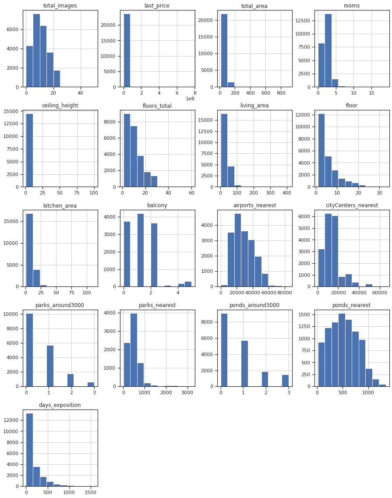
    


<div class="alert alert-success">
<b>✔️ Комментарий ревьюера v1:</b> 
<br>Графики построено верно! 
</div>
															
<div class="alert alert-warning">
<b>⚠️ Комментарий ревьюера v1:</b> 
<br>Если после кода вызывающего график добавить ";", то мы избавимся от строчки над графиком)

	data.hist(figsize=(15, 20));
</div>

Проанализировав сводную информацию о датасете недвижимости, не нужно быть гениями, чтобы понять тот простой факт, что он включает в себя жилье различных классов. То есть там есть как бюджетное так и элитное жилье. Очевидно, что элитного жилья не так и много, поэтому оно вносит в общий датасет некоторую неразбериху портя тем самым общие показатели. 

Убедимся, что финальная цена объявления не является ошибочной, а просто представляет жилье разных классов. Известно, что цена недвижимости в общем случае распределяется по логнормальному закону распределения. Это говорит о том, что ее логарифм (логарифм цены) - должен быть распределен по нормальному (гауссовому) закону. Сначала проверим это графически через гистограмму.


```python
np.log2(data['last_price']).hist(bins=50);
plt.xlabel('$log_2$(Last price)');
plt.title('$log_2$(Last price) distribution');

```


    
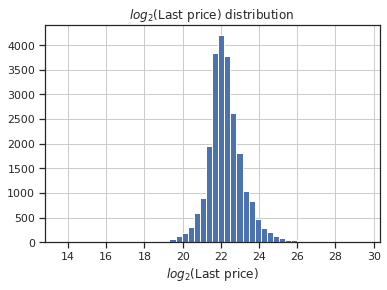
    


График говорит нам о логнормаьном распределении цены, что отлично согласуется с теорией. Однако же проверим наше предположение и с использованием статистического вывода. Применять для проверки нормальности распределения будем D’Agostino and Pearson’s test (стат. критерий Шапиро-Уилка не подойдет по причине неточного вычисления p-value по набору данных из более чем 5.000 точек)

Будем рассматривать гипотезу 

$H_0 = \{log_2(last price)$ имеет нормальное распределение $\}$

тогда 

$H_1 = \{log_2(last price)$ не имеет нормального распределения $\}$

Будем использовать стандартное пороговое значение $\alpha=0.05$


```python
k2, p_value = stats.normaltest(np.log2(data['last_price']))
p_value
```


    0.0


Ничтожно малое значение p-value не позволяет нам отвергнуть гипотезу $H_0$. Теперь мы можем быть абсолютно уверены в логнормальности распределения цены. Слишком большой разброс цены говорит о разнородности нашего исходного датасета и включении в него принципиально разных классов недвижимости. 


```python
data.describe()
```


<div>
<style scoped>
    .dataframe tbody tr th:only-of-type {
        vertical-align: middle;
    }

    .dataframe tbody tr th {
        vertical-align: top;
    }

    .dataframe thead th {
        text-align: right;
    }
</style>
<table border="1" class="dataframe">
  <thead>
    <tr style="text-align: right;">
      <th></th>
      <th>total_images</th>
      <th>last_price</th>
      <th>total_area</th>
      <th>rooms</th>
      <th>ceiling_height</th>
      <th>floors_total</th>
      <th>living_area</th>
      <th>floor</th>
      <th>kitchen_area</th>
      <th>balcony</th>
      <th>airports_nearest</th>
      <th>cityCenters_nearest</th>
      <th>parks_around3000</th>
      <th>parks_nearest</th>
      <th>ponds_around3000</th>
      <th>ponds_nearest</th>
      <th>days_exposition</th>
    </tr>
  </thead>
  <tbody>
    <tr>
      <th>count</th>
      <td>23699.000000</td>
      <td>2.369900e+04</td>
      <td>23699.000000</td>
      <td>23699.000000</td>
      <td>14504.000000</td>
      <td>23613.000000</td>
      <td>21796.000000</td>
      <td>23699.000000</td>
      <td>21421.000000</td>
      <td>12180.000000</td>
      <td>18157.000000</td>
      <td>18180.000000</td>
      <td>18181.000000</td>
      <td>8079.000000</td>
      <td>18181.000000</td>
      <td>9110.000000</td>
      <td>20518.000000</td>
    </tr>
    <tr>
      <th>mean</th>
      <td>9.858475</td>
      <td>6.541549e+06</td>
      <td>60.348651</td>
      <td>2.070636</td>
      <td>2.771499</td>
      <td>10.673824</td>
      <td>34.457852</td>
      <td>5.892358</td>
      <td>10.569807</td>
      <td>1.150082</td>
      <td>28793.672193</td>
      <td>14191.277833</td>
      <td>0.611408</td>
      <td>490.804555</td>
      <td>0.770255</td>
      <td>517.980900</td>
      <td>180.888634</td>
    </tr>
    <tr>
      <th>std</th>
      <td>5.682529</td>
      <td>1.088701e+07</td>
      <td>35.654083</td>
      <td>1.078405</td>
      <td>1.261056</td>
      <td>6.597173</td>
      <td>22.030445</td>
      <td>4.885249</td>
      <td>5.905438</td>
      <td>1.071300</td>
      <td>12630.880622</td>
      <td>8608.386210</td>
      <td>0.802074</td>
      <td>342.317995</td>
      <td>0.938346</td>
      <td>277.720643</td>
      <td>219.727988</td>
    </tr>
    <tr>
      <th>min</th>
      <td>0.000000</td>
      <td>1.219000e+04</td>
      <td>12.000000</td>
      <td>0.000000</td>
      <td>1.000000</td>
      <td>1.000000</td>
      <td>2.000000</td>
      <td>1.000000</td>
      <td>1.300000</td>
      <td>0.000000</td>
      <td>0.000000</td>
      <td>181.000000</td>
      <td>0.000000</td>
      <td>1.000000</td>
      <td>0.000000</td>
      <td>13.000000</td>
      <td>1.000000</td>
    </tr>
    <tr>
      <th>25%</th>
      <td>6.000000</td>
      <td>3.400000e+06</td>
      <td>40.000000</td>
      <td>1.000000</td>
      <td>2.520000</td>
      <td>5.000000</td>
      <td>18.600000</td>
      <td>2.000000</td>
      <td>7.000000</td>
      <td>0.000000</td>
      <td>18585.000000</td>
      <td>9238.000000</td>
      <td>0.000000</td>
      <td>288.000000</td>
      <td>0.000000</td>
      <td>294.000000</td>
      <td>45.000000</td>
    </tr>
    <tr>
      <th>50%</th>
      <td>9.000000</td>
      <td>4.650000e+06</td>
      <td>52.000000</td>
      <td>2.000000</td>
      <td>2.650000</td>
      <td>9.000000</td>
      <td>30.000000</td>
      <td>4.000000</td>
      <td>9.100000</td>
      <td>1.000000</td>
      <td>26726.000000</td>
      <td>13098.500000</td>
      <td>0.000000</td>
      <td>455.000000</td>
      <td>1.000000</td>
      <td>502.000000</td>
      <td>95.000000</td>
    </tr>
    <tr>
      <th>75%</th>
      <td>14.000000</td>
      <td>6.800000e+06</td>
      <td>69.900000</td>
      <td>3.000000</td>
      <td>2.800000</td>
      <td>16.000000</td>
      <td>42.300000</td>
      <td>8.000000</td>
      <td>12.000000</td>
      <td>2.000000</td>
      <td>37273.000000</td>
      <td>16293.000000</td>
      <td>1.000000</td>
      <td>612.000000</td>
      <td>1.000000</td>
      <td>729.000000</td>
      <td>232.000000</td>
    </tr>
    <tr>
      <th>max</th>
      <td>50.000000</td>
      <td>7.630000e+08</td>
      <td>900.000000</td>
      <td>19.000000</td>
      <td>100.000000</td>
      <td>60.000000</td>
      <td>409.700000</td>
      <td>33.000000</td>
      <td>112.000000</td>
      <td>5.000000</td>
      <td>84869.000000</td>
      <td>65968.000000</td>
      <td>3.000000</td>
      <td>3190.000000</td>
      <td>3.000000</td>
      <td>1344.000000</td>
      <td>1580.000000</td>
    </tr>
  </tbody>
</table>
</div>


**Промежуточный вывод:** смогли открыть и посмотреть данные. Обнаружили, проанализировав цену, что в данных присутствует два класса жилья которые принципиально нельзя рассматривать внутри одного датасета потому что законы рынка элитной недвижимости абсолютно иные. Займемся разделением датасета в следующем разделе.

<div class="alert alert-success">
<b>✔️ Комментарий ревьюера v1:</b> 
<br>Всё верно! Рекомендую создать универсальную функцию, которая будет на вход принимать датафрейм, а на выходе будет выводить все необходимые характеристики поочередно применяя методы head, describe, info, duplicated и т.п.
</div>

### Предобработка данных

Перед тем как начать разбираться с пропусками - все же проанализируем общий датасет еще раз с целью разбить его по классам жилья. Введем новый столбец - `class_real_estate`:

* `normal` - при цене кв.м. < 150k руб
* `elite` - при цене кв.м. >= 150k руб.


```python
def type_real_estate(row):
    #if price of sq.m. < 150k
    if row['last_price']/row['total_area'] < 150000:
        return 0
    else:
        return 1
data['class_real_estate'] = data.apply(type_real_estate, axis=1)
data.columns
data.info()
```

    <class 'pandas.core.frame.DataFrame'>
    RangeIndex: 23699 entries, 0 to 23698
    Data columns (total 23 columns):
     #   Column                Non-Null Count  Dtype  
    ---  ------                --------------  -----  
     0   total_images          23699 non-null  int64  
     1   last_price            23699 non-null  float64
     2   total_area            23699 non-null  float64
     3   first_day_exposition  23699 non-null  object 
     4   rooms                 23699 non-null  int64  
     5   ceiling_height        14504 non-null  float64
     6   floors_total          23613 non-null  float64
     7   living_area           21796 non-null  float64
     8   floor                 23699 non-null  int64  
     9   is_apartment          2775 non-null   object 
     10  studio                23699 non-null  bool   
     11  open_plan             23699 non-null  bool   
     12  kitchen_area          21421 non-null  float64
     13  balcony               12180 non-null  float64
     14  locality_name         23650 non-null  object 
     15  airports_nearest      18157 non-null  float64
     16  cityCenters_nearest   18180 non-null  float64
     17  parks_around3000      18181 non-null  float64
     18  parks_nearest         8079 non-null   float64
     19  ponds_around3000      18181 non-null  float64
     20  ponds_nearest         9110 non-null   float64
     21  days_exposition       20518 non-null  float64
     22  class_real_estate     23699 non-null  int64  
    dtypes: bool(2), float64(14), int64(4), object(3)
    memory usage: 3.8+ MB


```python
sns.pairplot(data.loc[:,['total_images', 'last_price', 'total_area',
       'rooms', 'ceiling_height', 'floors_total', 'living_area', 'floor',
         'kitchen_area', 'balcony',
       'airports_nearest', 'cityCenters_nearest',
       'parks_around3000', 'parks_nearest', 'ponds_around3000',
       'ponds_nearest', 'days_exposition', 'class_real_estate']], hue='class_real_estate' );
```


    
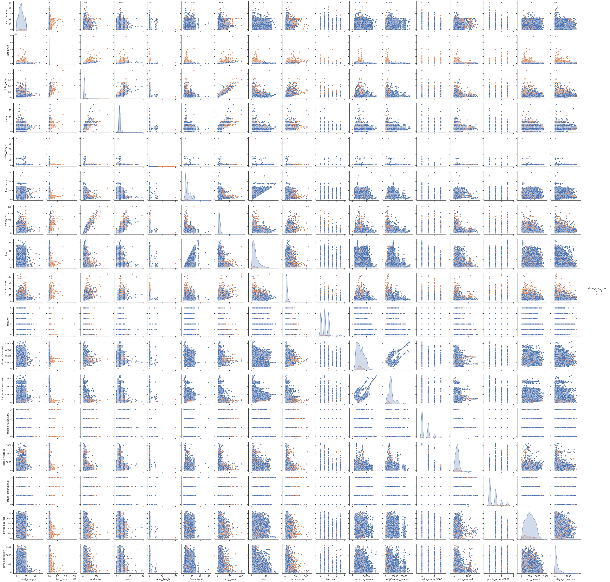
    


Посмотрев на наши данные в разрезе элитарной/обычной недвижимости (условная грань была проведена на цене в 150.000 руб/кв.м., (за схожий период данные по элитной недвижимости со средними показателями можно посмотреть в таблице ниже) - можно увидеть, что элитарность жилья введенная нами таким образом не меняет общий характер распределения (элитарное и обычное жилье по большей части распределены одинаково), однако элитарная недвижимость порою берет на себя многие выбросы. Безусловно, сама по себе грань, которая отделяет элитарное жилье от обычного в нашем случае должна быть результатом отдельного исследования - на каком уровне произвести отсечку, но ввиду ограниченности нашего времени будем полагаться на информацию от groupmarketing.ru - статья "Обзор рынка недвижимости 2017 в г.Санкт-Петербург". Все материалы которые мне удалось найти в открытом доступе не указывают на границу от которойц начинается элитное жилье, лишь средний показатель, поэтому граница в 90.000 была выбрана по сути интуитивно, основываясь на том, что среднее (явно медиана, а не среднее арифметическое, которое ужасно сильно чувствительно к выбросам, которых в элитной недвижимости очень много) должно быть порядка 175.000  

Таким образом мы получим 2 датасета, которые и будем в дальнейшем анализировать. Элитарное жилье и обычное жилье. Разнесем их для удобства в 2 датафрейма.


```python
df_normal = data[data['class_real_estate'] == 0].iloc[:,:-1]
df_elite = data[data['class_real_estate'] == 1].iloc[:,:-1]
print(f'Количество объявлений с обычным жильем: {df_normal.shape[0]}')
print(f'Количество объявлений с элитным жильем: {df_elite.shape[0]}')
df_elite.head(10)
```

    Количество объявлений с обычным жильем: 22047
    Количество объявлений с элитным жильем: 1652


<div>
<style scoped>
    .dataframe tbody tr th:only-of-type {
        vertical-align: middle;
    }

    .dataframe tbody tr th {
        vertical-align: top;
    }

    .dataframe thead th {
        text-align: right;
    }
</style>
<table border="1" class="dataframe">
  <thead>
    <tr style="text-align: right;">
      <th></th>
      <th>total_images</th>
      <th>last_price</th>
      <th>total_area</th>
      <th>first_day_exposition</th>
      <th>rooms</th>
      <th>ceiling_height</th>
      <th>floors_total</th>
      <th>living_area</th>
      <th>floor</th>
      <th>is_apartment</th>
      <th>studio</th>
      <th>open_plan</th>
      <th>kitchen_area</th>
      <th>balcony</th>
      <th>locality_name</th>
      <th>airports_nearest</th>
      <th>cityCenters_nearest</th>
      <th>parks_around3000</th>
      <th>parks_nearest</th>
      <th>ponds_around3000</th>
      <th>ponds_nearest</th>
      <th>days_exposition</th>
    </tr>
  </thead>
  <tbody>
    <tr>
      <th>3</th>
      <td>0</td>
      <td>64900000.0</td>
      <td>159.0</td>
      <td>2015-07-24T00:00:00</td>
      <td>3</td>
      <td>NaN</td>
      <td>14.0</td>
      <td>NaN</td>
      <td>9</td>
      <td>NaN</td>
      <td>False</td>
      <td>False</td>
      <td>NaN</td>
      <td>0.0</td>
      <td>Санкт-Петербург</td>
      <td>28098.0</td>
      <td>6800.0</td>
      <td>2.0</td>
      <td>84.0</td>
      <td>3.0</td>
      <td>234.0</td>
      <td>424.0</td>
    </tr>
    <tr>
      <th>43</th>
      <td>13</td>
      <td>9330000.0</td>
      <td>48.0</td>
      <td>2017-01-10T00:00:00</td>
      <td>2</td>
      <td>3.0</td>
      <td>4.0</td>
      <td>28.00</td>
      <td>4</td>
      <td>NaN</td>
      <td>False</td>
      <td>False</td>
      <td>7.50</td>
      <td>NaN</td>
      <td>Санкт-Петербург</td>
      <td>15016.0</td>
      <td>10822.0</td>
      <td>0.0</td>
      <td>NaN</td>
      <td>1.0</td>
      <td>492.0</td>
      <td>763.0</td>
    </tr>
    <tr>
      <th>51</th>
      <td>7</td>
      <td>45000000.0</td>
      <td>161.0</td>
      <td>2017-10-17T00:00:00</td>
      <td>3</td>
      <td>3.2</td>
      <td>8.0</td>
      <td>38.00</td>
      <td>4</td>
      <td>NaN</td>
      <td>False</td>
      <td>False</td>
      <td>50.00</td>
      <td>NaN</td>
      <td>Санкт-Петербург</td>
      <td>32537.0</td>
      <td>6589.0</td>
      <td>0.0</td>
      <td>NaN</td>
      <td>3.0</td>
      <td>99.0</td>
      <td>541.0</td>
    </tr>
    <tr>
      <th>63</th>
      <td>2</td>
      <td>20000000.0</td>
      <td>118.0</td>
      <td>2018-09-11T00:00:00</td>
      <td>3</td>
      <td>3.0</td>
      <td>9.0</td>
      <td>68.00</td>
      <td>7</td>
      <td>NaN</td>
      <td>False</td>
      <td>False</td>
      <td>16.00</td>
      <td>NaN</td>
      <td>Санкт-Петербург</td>
      <td>26055.0</td>
      <td>4800.0</td>
      <td>1.0</td>
      <td>648.0</td>
      <td>1.0</td>
      <td>779.0</td>
      <td>37.0</td>
    </tr>
    <tr>
      <th>81</th>
      <td>9</td>
      <td>10949000.0</td>
      <td>68.0</td>
      <td>2018-12-27T00:00:00</td>
      <td>1</td>
      <td>NaN</td>
      <td>10.0</td>
      <td>NaN</td>
      <td>6</td>
      <td>NaN</td>
      <td>False</td>
      <td>False</td>
      <td>NaN</td>
      <td>NaN</td>
      <td>Санкт-Петербург</td>
      <td>NaN</td>
      <td>NaN</td>
      <td>NaN</td>
      <td>NaN</td>
      <td>NaN</td>
      <td>NaN</td>
      <td>NaN</td>
    </tr>
    <tr>
      <th>105</th>
      <td>12</td>
      <td>4900000.0</td>
      <td>32.0</td>
      <td>2018-01-07T00:00:00</td>
      <td>1</td>
      <td>NaN</td>
      <td>25.0</td>
      <td>15.00</td>
      <td>5</td>
      <td>NaN</td>
      <td>False</td>
      <td>False</td>
      <td>9.00</td>
      <td>NaN</td>
      <td>Санкт-Петербург</td>
      <td>52480.0</td>
      <td>15598.0</td>
      <td>0.0</td>
      <td>NaN</td>
      <td>1.0</td>
      <td>464.0</td>
      <td>60.0</td>
    </tr>
    <tr>
      <th>114</th>
      <td>5</td>
      <td>4000000.0</td>
      <td>21.4</td>
      <td>2019-02-07T00:00:00</td>
      <td>1</td>
      <td>2.9</td>
      <td>8.0</td>
      <td>8.30</td>
      <td>7</td>
      <td>NaN</td>
      <td>False</td>
      <td>False</td>
      <td>6.30</td>
      <td>NaN</td>
      <td>Санкт-Петербург</td>
      <td>27089.0</td>
      <td>5791.0</td>
      <td>2.0</td>
      <td>488.0</td>
      <td>1.0</td>
      <td>286.0</td>
      <td>NaN</td>
    </tr>
    <tr>
      <th>121</th>
      <td>20</td>
      <td>33000000.0</td>
      <td>180.0</td>
      <td>2017-02-17T00:00:00</td>
      <td>3</td>
      <td>2.9</td>
      <td>9.0</td>
      <td>86.00</td>
      <td>8</td>
      <td>False</td>
      <td>False</td>
      <td>False</td>
      <td>24.00</td>
      <td>4.0</td>
      <td>Санкт-Петербург</td>
      <td>25689.0</td>
      <td>4264.0</td>
      <td>1.0</td>
      <td>633.0</td>
      <td>0.0</td>
      <td>NaN</td>
      <td>144.0</td>
    </tr>
    <tr>
      <th>137</th>
      <td>11</td>
      <td>13310800.0</td>
      <td>85.1</td>
      <td>2018-01-01T00:00:00</td>
      <td>2</td>
      <td>2.7</td>
      <td>10.0</td>
      <td>31.52</td>
      <td>5</td>
      <td>NaN</td>
      <td>False</td>
      <td>False</td>
      <td>26.85</td>
      <td>1.0</td>
      <td>Санкт-Петербург</td>
      <td>31460.0</td>
      <td>4263.0</td>
      <td>1.0</td>
      <td>141.0</td>
      <td>3.0</td>
      <td>133.0</td>
      <td>340.0</td>
    </tr>
    <tr>
      <th>140</th>
      <td>8</td>
      <td>16912000.0</td>
      <td>105.7</td>
      <td>2016-12-09T00:00:00</td>
      <td>2</td>
      <td>2.7</td>
      <td>3.0</td>
      <td>48.40</td>
      <td>1</td>
      <td>NaN</td>
      <td>False</td>
      <td>False</td>
      <td>15.40</td>
      <td>NaN</td>
      <td>Пушкин</td>
      <td>14352.0</td>
      <td>26506.0</td>
      <td>3.0</td>
      <td>366.0</td>
      <td>3.0</td>
      <td>179.0</td>
      <td>390.0</td>
    </tr>
  </tbody>
</table>
</div>


```python
data.columns
```


    Index(['total_images', 'last_price', 'total_area', 'first_day_exposition',
           'rooms', 'ceiling_height', 'floors_total', 'living_area', 'floor',
           'is_apartment', 'studio', 'open_plan', 'kitchen_area', 'balcony',
           'locality_name', 'airports_nearest', 'cityCenters_nearest',
           'parks_around3000', 'parks_nearest', 'ponds_around3000',
           'ponds_nearest', 'days_exposition', 'class_real_estate'],
          dtype='object')


Посмотрим количество пропусков (в % от общего числа объектов в датасете) в различных столбцах и будем разбираться с каждым столбцом отдельно


```python
#dictionary with sense of features, translated in Russian
translate_features_dict = {'total_images': 'число фотографий квартиры в объявлении',
                           'last_price': 'цена на момент снятия с публикации',
                           'total_area': "общая площадь квартиры в квадратных метрах (м²)",
                           'first_day_exposition': 'дата публикации',
                           'rooms': "число комнат", 
                           'ceiling_height': 'высота потолков (м)',
                           'floors_total': 'всего этажей в доме',
                           'living_area': 'жилая площадь в квадратных метрах (м²)',
                           'floor': 'этаж',
                           'is_apartment': 'апартаменты?',
                           'studio': 'квартира-студия?',
                           'open_plan': 'свободная планировка?',
                           'kitchen_area': 'площадь кухни в квадратных метрах (м²)',
                           'balcony': 'число балконов',
                           'locality_name': 'название населённого пункта',
                           'airports_nearest': 'расстояние до ближайшего аэропорта в метрах (м)',
                           'cityCenters_nearest': 'расстояние до центра города (м)',
                           'parks_around3000': 'число парков в радиусе 3 км',
                           'parks_nearest': 'расстояние до ближайшего парка (м)',
                           'ponds_around3000': 'число водоёмов в радиусе 3 км',
                           'ponds_nearest': 'расстояние до ближайшего водоёма (м)',
                           'days_exposition': 'сколько дней было размещено объявление', 
                           }
def russian_feature(row):
    return translate_features_dict[row['feature']]


nan_stats = (100*df_normal.isna().sum()/df_normal.shape[0]).reset_index()
nan_stats['elite'] = (100*df_elite.isna().sum()/df_elite.shape[0]).reset_index()[0]
nan_stats.columns = ['feature', 'normal', 'elite']
nan_stats = nan_stats.query('normal>5 or elite>5')
nan_stats = pd.melt(nan_stats, id_vars="feature", var_name="real_estate_type", value_name="fraction_in_percents")
nan_stats['russian_feature'] = nan_stats.apply(russian_feature, axis=1)

#NaN < 5% for both real estate classes
set(translate_features_dict.keys())-set(nan_stats.feature)
#let's remove data with small amount of NaN from both datasets
```


    {'first_day_exposition',
     'floor',
     'floors_total',
     'last_price',
     'locality_name',
     'open_plan',
     'rooms',
     'studio',
     'total_area',
     'total_images'}


Предварительно очистим оба наших датасета от данных где пропусков в обоих классах жилья менее 5% удалив такие данные.


```python
old_size_normal = df_normal.shape[0]
old_size_elite = df_elite.shape[0]
```


```python
#NaN < 5% for both real estate classes
small_nan_amount_set = set(translate_features_dict.keys())-set(nan_stats.feature)
small_nan_amount_set
#let's remove data with small amount of NaN from both datasets
df_normal=df_normal.dropna(subset=(small_nan_amount_set))
df_elite=df_elite.dropna(subset=small_nan_amount_set)
```


```python
sns.set(font_scale=2)
g=sns.catplot(x='feature', y='fraction_in_percents', hue='real_estate_type', data=nan_stats, kind='bar', legend=False);
g.fig.set_size_inches(38,10);
g.set_xticklabels(rotation=90);
g.set(xlabel='Признаки (фичи)', 
      ylabel='Доля пропусков, %', 
      title='Признаки с существенной долей (более 5% хотя бы для одного из типов недвижимости) пропусков');
plt.legend(loc='upper left', title='Type');

```


    
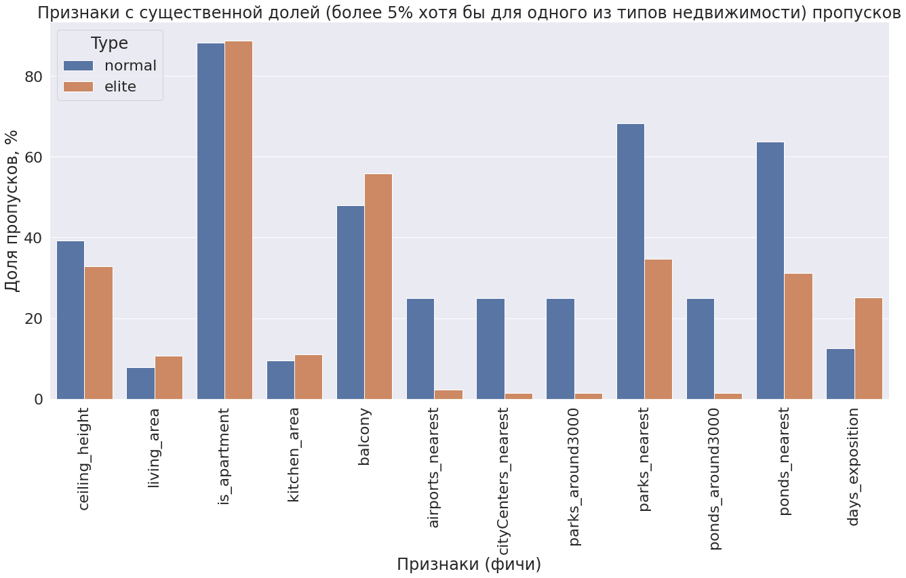
    


## ЧТОБЫ НЕ ДЕЛАТЬ ЭТОТ ОТЧЕТ БЕСКОНЕЧНЫМ УСЛОВИМСЯ ДАЛЕЕ РАБОТАТЬ ТОЛЬКО С ОБЫЧНОЙ НЕДВИЖИМОСТЬЮ, ОСТАВИВ РАБОТУ С ЭЛИТНОЙ НЕДВИЖИМОСТЬЮ ЛЮБОПЫТНЫМ ЧИТАТЕЛЯМ

<div class="alert alert-warning">
<b>⚠️ Комментарий ревьюера v1:</b> 
<br>Верное решение! Я вообще рекомендую придерживаться структуры проекта и следовать ей, а дополнительные задания от себя выполнять в том случае, если ты уже сделал основное
</div>


```python
df_normal['is_apartment'].fillna(value=False, inplace=True)
df_elite['is_apartment'].fillna(value=False, inplace=True)
df_normal['balcony'].fillna(value=0, inplace=True)
df_elite['balcony'].fillna(value=0, inplace=True)
```

<div class="alert alert-success">
<b>✔️ Комментарий ревьюера v1:</b> 
<br>👌
</div>

<div class="alert alert-info">
<b>После твоего комментария я посмотрел на данные иначе и согласилося, что пропуски в высоте потолков разумно заменить медианным значением ввиду малого стандартного отклонения, однако на рынок элитной недвижимости я это переносить не стал так как стандартное отклонение близко к показателю среднего то есть в элитной недвижимости заменив такие пропуски мы получим мусор. Новые ячейки с кодом мои ниже v1</b>
<br>
</div>

<div class="alert alert-success">
<b>✔️ Комментарий ревьюера v2:</b>
<br>Отличное решение!
</div>


```python
print('В обычном жилье:')
print('Среднее ар.:', df_normal['ceiling_height'].mean(), 'Медиана:', df_normal['ceiling_height'].median(),
      'Стандартное отклонение:', df_normal['ceiling_height'].std())
```

    В обычном жилье:
    Среднее ар.: 2.7403132241907753 Медиана: 2.6 Стандартное отклонение: 0.9770413235253126


```python
print('В элитном жилье:')
print('Среднее ар.:', df_elite['ceiling_height'].mean(), 'Медиана:', df_elite['ceiling_height'].median(),
      'Стандартное отклонение:', df_elite['ceiling_height'].std())
```

    В элитном жилье:
    Среднее ар.: 3.1465398550724637 Медиана: 3.0 Стандартное отклонение: 3.029576774514933


```python
df_normal['ceiling_height'].fillna(value=df_normal['ceiling_height'].median(), inplace=True)
```

<div class="alert alert-info">
<b>Конец праваок ячеек с кодом v1</b>
<br>
</div>

Мы смогли логично предположить, что пропуски можно заменить при условии пропущенного `балкона` (тогда его просто нет будем считать) и если пропуски в поле `апартаменты` - тогда будем считать, что недвижимость апартаментами не является, все таки пока в стране еще слишком мало таких объектов и многие не указывают этот параметр просто потому что не всегда в курсе что он означает.

Заменить же пропуски в высоте потолков, общей площади жилья, площади кухни - ничем разумным не представляется возможным - использование для этих целей медианы и подобных значений мало поможет так как мы занимаемся анализом рынка недвижимости и очень вряд ли площадь жилья конкретной квартиры можно заменить средней площадью жилья по городу. Заполнение же пропусков в количестве дней нахождения объявления в ротации - вообще губительно для данных - жилье может быть не продано на момент создания датасета.

Однако попробуем взглянуть поближе на гео-данные о парках, водоемах и расстоянии по маршруту до центра и аэропорта. Сгруппируем наши данные по длине маршрутов до аэропорта и центра (будем их использовать в качестве индекса и отсортируем по нему)


```python
df_normal.set_index(['airports_nearest', 'cityCenters_nearest']).sort_index()[['parks_around3000', 'parks_nearest', 'ponds_around3000',
       'ponds_nearest']].head(50)

```


<div>
<style scoped>
    .dataframe tbody tr th:only-of-type {
        vertical-align: middle;
    }

    .dataframe tbody tr th {
        vertical-align: top;
    }

    .dataframe thead th {
        text-align: right;
    }
</style>
<table border="1" class="dataframe">
  <thead>
    <tr style="text-align: right;">
      <th></th>
      <th></th>
      <th>parks_around3000</th>
      <th>parks_nearest</th>
      <th>ponds_around3000</th>
      <th>ponds_nearest</th>
    </tr>
    <tr>
      <th>airports_nearest</th>
      <th>cityCenters_nearest</th>
      <th></th>
      <th></th>
      <th></th>
      <th></th>
    </tr>
  </thead>
  <tbody>
    <tr>
      <th rowspan="2" valign="top">6450.0</th>
      <th>17461.0</th>
      <td>0.0</td>
      <td>NaN</td>
      <td>1.0</td>
      <td>444.0</td>
    </tr>
    <tr>
      <th>17461.0</th>
      <td>0.0</td>
      <td>NaN</td>
      <td>1.0</td>
      <td>444.0</td>
    </tr>
    <tr>
      <th>6914.0</th>
      <th>21486.0</th>
      <td>1.0</td>
      <td>215.0</td>
      <td>0.0</td>
      <td>NaN</td>
    </tr>
    <tr>
      <th>6949.0</th>
      <th>13165.0</th>
      <td>1.0</td>
      <td>711.0</td>
      <td>0.0</td>
      <td>NaN</td>
    </tr>
    <tr>
      <th rowspan="6" valign="top">6989.0</th>
      <th>13205.0</th>
      <td>1.0</td>
      <td>535.0</td>
      <td>0.0</td>
      <td>NaN</td>
    </tr>
    <tr>
      <th>13205.0</th>
      <td>1.0</td>
      <td>535.0</td>
      <td>0.0</td>
      <td>NaN</td>
    </tr>
    <tr>
      <th>13205.0</th>
      <td>1.0</td>
      <td>535.0</td>
      <td>0.0</td>
      <td>NaN</td>
    </tr>
    <tr>
      <th>13205.0</th>
      <td>1.0</td>
      <td>535.0</td>
      <td>0.0</td>
      <td>NaN</td>
    </tr>
    <tr>
      <th>13205.0</th>
      <td>1.0</td>
      <td>535.0</td>
      <td>0.0</td>
      <td>NaN</td>
    </tr>
    <tr>
      <th>13205.0</th>
      <td>1.0</td>
      <td>535.0</td>
      <td>0.0</td>
      <td>NaN</td>
    </tr>
    <tr>
      <th>6992.0</th>
      <th>17168.0</th>
      <td>1.0</td>
      <td>649.0</td>
      <td>0.0</td>
      <td>NaN</td>
    </tr>
    <tr>
      <th rowspan="2" valign="top">6995.0</th>
      <th>17171.0</th>
      <td>1.0</td>
      <td>823.0</td>
      <td>0.0</td>
      <td>NaN</td>
    </tr>
    <tr>
      <th>17171.0</th>
      <td>1.0</td>
      <td>823.0</td>
      <td>0.0</td>
      <td>NaN</td>
    </tr>
    <tr>
      <th>7002.0</th>
      <th>13218.0</th>
      <td>1.0</td>
      <td>830.0</td>
      <td>0.0</td>
      <td>NaN</td>
    </tr>
    <tr>
      <th rowspan="4" valign="top">7016.0</th>
      <th>13230.0</th>
      <td>1.0</td>
      <td>731.0</td>
      <td>0.0</td>
      <td>NaN</td>
    </tr>
    <tr>
      <th>13230.0</th>
      <td>1.0</td>
      <td>731.0</td>
      <td>0.0</td>
      <td>NaN</td>
    </tr>
    <tr>
      <th>13230.0</th>
      <td>1.0</td>
      <td>731.0</td>
      <td>0.0</td>
      <td>NaN</td>
    </tr>
    <tr>
      <th>13232.0</th>
      <td>1.0</td>
      <td>731.0</td>
      <td>0.0</td>
      <td>NaN</td>
    </tr>
    <tr>
      <th rowspan="3" valign="top">7019.0</th>
      <th>13235.0</th>
      <td>1.0</td>
      <td>712.0</td>
      <td>0.0</td>
      <td>NaN</td>
    </tr>
    <tr>
      <th>13235.0</th>
      <td>1.0</td>
      <td>712.0</td>
      <td>0.0</td>
      <td>NaN</td>
    </tr>
    <tr>
      <th>13235.0</th>
      <td>1.0</td>
      <td>712.0</td>
      <td>0.0</td>
      <td>NaN</td>
    </tr>
    <tr>
      <th rowspan="14" valign="top">7026.0</th>
      <th>13242.0</th>
      <td>1.0</td>
      <td>842.0</td>
      <td>0.0</td>
      <td>NaN</td>
    </tr>
    <tr>
      <th>13242.0</th>
      <td>1.0</td>
      <td>842.0</td>
      <td>0.0</td>
      <td>NaN</td>
    </tr>
    <tr>
      <th>13242.0</th>
      <td>1.0</td>
      <td>842.0</td>
      <td>0.0</td>
      <td>NaN</td>
    </tr>
    <tr>
      <th>13242.0</th>
      <td>1.0</td>
      <td>842.0</td>
      <td>0.0</td>
      <td>NaN</td>
    </tr>
    <tr>
      <th>13242.0</th>
      <td>1.0</td>
      <td>842.0</td>
      <td>0.0</td>
      <td>NaN</td>
    </tr>
    <tr>
      <th>13242.0</th>
      <td>1.0</td>
      <td>842.0</td>
      <td>0.0</td>
      <td>NaN</td>
    </tr>
    <tr>
      <th>13242.0</th>
      <td>1.0</td>
      <td>842.0</td>
      <td>0.0</td>
      <td>NaN</td>
    </tr>
    <tr>
      <th>13242.0</th>
      <td>1.0</td>
      <td>842.0</td>
      <td>0.0</td>
      <td>NaN</td>
    </tr>
    <tr>
      <th>13242.0</th>
      <td>1.0</td>
      <td>842.0</td>
      <td>0.0</td>
      <td>NaN</td>
    </tr>
    <tr>
      <th>13242.0</th>
      <td>1.0</td>
      <td>842.0</td>
      <td>0.0</td>
      <td>NaN</td>
    </tr>
    <tr>
      <th>13242.0</th>
      <td>1.0</td>
      <td>842.0</td>
      <td>0.0</td>
      <td>NaN</td>
    </tr>
    <tr>
      <th>13242.0</th>
      <td>1.0</td>
      <td>842.0</td>
      <td>0.0</td>
      <td>NaN</td>
    </tr>
    <tr>
      <th>13242.0</th>
      <td>1.0</td>
      <td>842.0</td>
      <td>0.0</td>
      <td>NaN</td>
    </tr>
    <tr>
      <th>13242.0</th>
      <td>1.0</td>
      <td>842.0</td>
      <td>0.0</td>
      <td>NaN</td>
    </tr>
    <tr>
      <th>7050.0</th>
      <th>13266.0</th>
      <td>1.0</td>
      <td>868.0</td>
      <td>0.0</td>
      <td>NaN</td>
    </tr>
    <tr>
      <th rowspan="2" valign="top">7056.0</th>
      <th>17233.0</th>
      <td>1.0</td>
      <td>658.0</td>
      <td>0.0</td>
      <td>NaN</td>
    </tr>
    <tr>
      <th>17233.0</th>
      <td>1.0</td>
      <td>658.0</td>
      <td>0.0</td>
      <td>NaN</td>
    </tr>
    <tr>
      <th>7083.0</th>
      <th>13298.0</th>
      <td>1.0</td>
      <td>1069.0</td>
      <td>0.0</td>
      <td>NaN</td>
    </tr>
    <tr>
      <th rowspan="5" valign="top">7106.0</th>
      <th>13322.0</th>
      <td>1.0</td>
      <td>1188.0</td>
      <td>0.0</td>
      <td>NaN</td>
    </tr>
    <tr>
      <th>13322.0</th>
      <td>1.0</td>
      <td>1188.0</td>
      <td>0.0</td>
      <td>NaN</td>
    </tr>
    <tr>
      <th>13322.0</th>
      <td>1.0</td>
      <td>1188.0</td>
      <td>0.0</td>
      <td>NaN</td>
    </tr>
    <tr>
      <th>13322.0</th>
      <td>1.0</td>
      <td>1188.0</td>
      <td>0.0</td>
      <td>NaN</td>
    </tr>
    <tr>
      <th>13322.0</th>
      <td>1.0</td>
      <td>1188.0</td>
      <td>0.0</td>
      <td>NaN</td>
    </tr>
    <tr>
      <th>7114.0</th>
      <th>13330.0</th>
      <td>1.0</td>
      <td>903.0</td>
      <td>0.0</td>
      <td>NaN</td>
    </tr>
    <tr>
      <th rowspan="4" valign="top">7145.0</th>
      <th>13360.0</th>
      <td>1.0</td>
      <td>1022.0</td>
      <td>0.0</td>
      <td>NaN</td>
    </tr>
    <tr>
      <th>13360.0</th>
      <td>1.0</td>
      <td>1022.0</td>
      <td>0.0</td>
      <td>NaN</td>
    </tr>
    <tr>
      <th>13360.0</th>
      <td>1.0</td>
      <td>1022.0</td>
      <td>0.0</td>
      <td>NaN</td>
    </tr>
    <tr>
      <th>13360.0</th>
      <td>1.0</td>
      <td>1022.0</td>
      <td>0.0</td>
      <td>NaN</td>
    </tr>
    <tr>
      <th>7201.0</th>
      <th>13417.0</th>
      <td>1.0</td>
      <td>1199.0</td>
      <td>0.0</td>
      <td>NaN</td>
    </tr>
  </tbody>
</table>
</div>


Легко бросается в глаза, что порой расстояния до ближайшего парка и пруда является пропуском, если в радиусе 3км нет ни одного парка или пруда соответственно. Такие пропуски имеют также смысл и трогать их не стоит. Можно было бы заменить их каким нибудь фиктивным числом более 3000 или отрицательным, но мы не станем этого делать. Есть же пропуски в столбце количества парков и водоемов в радиусе 3км. Эти пропуски тоже бесполезно чем-то заменять так как судя по их количеству (оно совпадает) с количеством пропусков в дистанции маршрута до аэропорта и центра. Логично, что если мы не смогли выяснить расстояние до объекта недвижимости от аэропорта и центра то мы и не знаем сколько там водоемов/парков. Значит и эти пропуски имеют естественную природу и их не будем трогать. А вот что действительно интересно - так это причина пропусков в количестве водоемов/парков в радиусе 3км - пропуски в расстояниях до аэропорта и центра города. Именно пропуски в расстояниях до аэропорта и центра города, скорее всего и являются причиной всех пропусков в гео-данных. Они могли взяться из-за невозможности вычислить координаты объекта. Возможно создатель объявление не указал точный адрес объекта и мы не смогли вычислить вычисляемые параметры по геолокации помещения такие как водная и парковая инфраструктура

Подумаем, что могло привести к потере данных для каждого столбца:
  
  * `высота потолков` - удивительно, что пропущенно всего менее 40% для обоих классов недвижимости. Высота потолков не является той информацией, которой хорошо владеют собственники и часто публикуют в объявлениях. Были просмотрены разные сайты по продаже жилья и почти нигде не был обнаружен такой параметр как высота потолков.
    
  * `жилая площадь`, `площадь кухни` - пропуски здесь могли появиться из-за того, что это уже весьма детализирующие объект признаки и не все продавцы хотят вносить такие данные в объявление.
    
  *  `балконы` - тут все может объясняться просто. Балкон это прерогатива и бонус. Раз его нет то и не указать можно.
    
  *  `расстояние до аэропорта`, `расстояние до центра` - это те параметры которые вычисляет система, но она не может вычислить эти параметры, если не знает точные координаты объекта. Скорее всего, пользователь предпочел не указывать в объявлении точный адрес своего объекта.
    
  * `количество парков в радиусе 3км`, `количество водоемов в радиусе 3км` - не зная геолокацию объектов мы не сможем вычислить и количество объектов водной/парковой инфраструктуры в окрестности объекта недвижимости
    
  * `расстояние до ближайшего парка`, `расстояние до ближайшего водоема` - помимо тех ситуаций когда мы не знаем геолокации объекта недвижимости сюда добавляются пропуски в тех ситуациях когда в радиусе 3 км отсутствует парк/водоем. Приблизительно совпадающее число пропусков в расстоянии до ближайших парков и водоемов связано скорее всего с тем, что Петербург стоит на Неве и воды там много и парков много потому что город туристический. Значит, если есть парк то есть и водоем в этом парке. Нет парка - нет и водоема. Логично же делать парки там где есть водоемы=)
  
  * `длительность размещения объявления` - пропуски трогать тут не следует - по ним мы узнаем объявления, которые находились в ротации на сайте на момент создания датасета. 

Мы не стали заполнять пропуски для высоты потолков и площади кухни/жилой площади никакими примитивными значениями типа медианного. Сложно себе представить много объектов с одним и тем же ничем не оправданным значением площади кухни =)

Если серьезно то мы могли бы заполнить высоту потолков и общую этажность дома, если бы у нас был серьезный коммерческий проект на аналитику. Расскажем здесь идею. Можно было бы вычислить координаты жилья (если бы расстояния до аэропорта и центра были бы по прямой, а не по маршруту с Яндекс карт). Зная координаты жилья мы могли бы определить тип дома и по кадастру узнать высоту потолков в нем и его этажность. Мы попытались ради любопытства определить координаты объектов недвижимости, но нас постигла неудача. Расскажем об этом опыте.

Для вычисления координат жилья нам необходимо знать координаты аэропорта (слава богу он один и не очень большой). А для того, чтобы понять где находится центр - надо его вычислить на примере одного из объектов недвижимости. Надо было найти какой-нибудь уникальный объект адрес которого было бы легко вычислить относительно и такой объект был найден. Это стала высотка в Парголово. Посмотрев на яндекс карты было очевидно, что в столбцах с расстояниями до центра и аэропорта занесены не расстояния по прямой, а по маршрутам со всеми объездами и дорожными приключениями. 

<div class="alert alert-warning">
<b>⚠️ Комментарий ревьюера v1:</b> 
<br>Пропуски в данном столбце как раз нужно заполнить, тем более мы можем достаточно точно их восстановить так как основная часть данных в этом столбце находится в небольшом диапазоне, а вот в случае с площадью это уже не работает
</div>

<div class="alert alert-info">
<b>Ты пишешь "в этом столбце" но я говорю о многих столбцах в этом тексте. скажи о каком речь пожалуйста. Я понял так что речь идет про пропуски данных в высоте потолков и сделал так ибо обнаружил что дисперсия высоты потолков действительно не велика</b>
<br>
</div>

<div class="alert alert-success">
<b>✔️ Комментарий ревьюера v2:</b>
<br>Да, прошу прощения) Ты всё правильно понял!
    
</div>


Рассмотрим теперь типы данных столбцов наших датафреймов и подумаем к чему их разумнее всего преобразовать, если такое преобразование имеет смысл


```python
df_normal.info();
```

    <class 'pandas.core.frame.DataFrame'>
    Int64Index: 21924 entries, 0 to 23698
    Data columns (total 22 columns):
     #   Column                Non-Null Count  Dtype  
    ---  ------                --------------  -----  
     0   total_images          21924 non-null  int64  
     1   last_price            21924 non-null  float64
     2   total_area            21924 non-null  float64
     3   first_day_exposition  21924 non-null  object 
     4   rooms                 21924 non-null  int64  
     5   ceiling_height        21924 non-null  float64
     6   floors_total          21924 non-null  float64
     7   living_area           20233 non-null  float64
     8   floor                 21924 non-null  int64  
     9   is_apartment          21924 non-null  bool   
     10  studio                21924 non-null  bool   
     11  open_plan             21924 non-null  bool   
     12  kitchen_area          19881 non-null  float64
     13  balcony               21924 non-null  float64
     14  locality_name         21924 non-null  object 
     15  airports_nearest      16437 non-null  float64
     16  cityCenters_nearest   16448 non-null  float64
     17  parks_around3000      16449 non-null  float64
     18  parks_nearest         6960 non-null   float64
     19  ponds_around3000      16449 non-null  float64
     20  ponds_nearest         7905 non-null   float64
     21  days_exposition       19164 non-null  float64
    dtypes: bool(3), float64(14), int64(3), object(2)
    memory usage: 3.4+ MB


Преобразуем типы данных у следующих столбцов обоих датафреймов:

* `first_day_exposition` - следует преобразовать к `datetime` - потому что сейчас это строка, а нам может понадобиться сравнивать даты и тд
* `floors_total` - к типу `Int64` - для того чтобы не было зданий в 3.5 этажа
* `balcony` - к типу `Int64` - чтобы избежать ситуации с 2.5 балконами
* `parks_around3000`, `ponds_around3000` - к типу `Int64` - чтобы не оказалась половинка пруда или парка
* `days_exposition` - к типу `Int64` - строго говоря здесь мы допускаем некоторую вольность - объявление может висеть 12.5 дней - но позволим себе эту вольность и будем рассматривать целое количество дней потому что время публикации у нас для всех объектов - полночь как мы посмотрели.


```python
df_normal['first_day_exposition'] = pd.to_datetime(df_normal['first_day_exposition'], format='%Y-%m-%dT%H:%M:%S')
df_normal['floors_total'] = df_normal['floors_total'].astype('Int64')
df_normal['balcony'] = df_normal['balcony'].astype('Int64')
df_normal['parks_around3000'] = df_normal['parks_around3000'].astype('Int64')
df_normal['ponds_around3000'] = df_normal['ponds_around3000'].astype('Int64')
df_normal['days_exposition'] = np.floor(pd.to_numeric(df_normal['days_exposition'], errors='coerce')).astype('Int64')

df_elite['first_day_exposition'] = pd.to_datetime(df_elite['first_day_exposition'], format='%Y-%m-%dT%H:%M:%S')
df_elite['floors_total'] = df_elite['floors_total'].astype('Int64')
df_elite['balcony'] = df_elite['balcony'].astype('Int64')
df_elite['parks_around3000'] = df_elite['parks_around3000'].astype('Int64')
df_elite['ponds_around3000'] = df_elite['ponds_around3000'].astype('Int64')
df_elite['days_exposition'] = np.floor(pd.to_numeric(df_elite['days_exposition'], errors='coerce')).astype('Int64')

#only df_normal, for elite - the same
df_normal.info()

```

    <class 'pandas.core.frame.DataFrame'>
    Int64Index: 21924 entries, 0 to 23698
    Data columns (total 22 columns):
     #   Column                Non-Null Count  Dtype         
    ---  ------                --------------  -----         
     0   total_images          21924 non-null  int64         
     1   last_price            21924 non-null  float64       
     2   total_area            21924 non-null  float64       
     3   first_day_exposition  21924 non-null  datetime64[ns]
     4   rooms                 21924 non-null  int64         
     5   ceiling_height        21924 non-null  float64       
     6   floors_total          21924 non-null  Int64         
     7   living_area           20233 non-null  float64       
     8   floor                 21924 non-null  int64         
     9   is_apartment          21924 non-null  bool          
     10  studio                21924 non-null  bool          
     11  open_plan             21924 non-null  bool          
     12  kitchen_area          19881 non-null  float64       
     13  balcony               21924 non-null  Int64         
     14  locality_name         21924 non-null  object        
     15  airports_nearest      16437 non-null  float64       
     16  cityCenters_nearest   16448 non-null  float64       
     17  parks_around3000      16449 non-null  Int64         
     18  parks_nearest         6960 non-null   float64       
     19  ponds_around3000      16449 non-null  Int64         
     20  ponds_nearest         7905 non-null   float64       
     21  days_exposition       19164 non-null  Int64         
    dtypes: Int64(5), bool(3), datetime64[ns](1), float64(9), int64(3), object(1)
    memory usage: 3.5+ MB


<div class="alert alert-success">
<b>✔️ Комментарий ревьюера v1:</b> 
<br>Изменение типов данных проведено верно. Можно ещё заменить тип данных с float64 на float32 для экономии памяти.
</div>

Посмотрим типы населенных пунктов в наших датасетах и найдем слова, которые встречаются в описании типа населенного пункта:


```python
locality_types_set=set()
locality_types_normal = df_normal['locality_name'].str.replace(r'[А-Я].*', r'', regex=True).sort_values().unique()
locality_types_elite = df_elite['locality_name'].str.replace(r'[А-Я].*', r'', regex=True).sort_values().unique()

print(f'Типы поселений (помимо города) с обычными объектами недвижимости: \n{locality_types_normal}, \
      \nТипы поселений (помимо города) с элитными объектами недвижимости:\n{locality_types_elite}')

#iterating over combination of 2 lists
for name in (list(locality_types_normal)+list(locality_types_elite)):
    locality_types_set = locality_types_set | set(name.split())

print(f'слова для обозначения типа поселения (для удаления из соответствующего столбца датафреймов):\n{locality_types_set}')
```

    Типы поселений (помимо города) с обычными объектами недвижимости: 
    ['' 'городской поселок ' 'городской посёлок ' 'деревня '
     'коттеджный поселок ' 'коттеджный посёлок ' 'поселок '
     'поселок городского типа ' 'поселок городского типа имени '
     'поселок станции ' 'посёлок ' 'посёлок городского типа '
     'посёлок городского типа имени ' 'посёлок при железнодорожной станции '
     'посёлок станции ' 'садоводческое некоммерческое товарищество '
     'садовое товарищество ' 'село '],       
    Типы поселений (помимо города) с элитными объектами недвижимости:
    ['' 'деревня ' 'посёлок ']
    слова для обозначения типа поселения (для удаления из соответствующего столбца датафреймов):
    {'село', 'деревня', 'имени', 'при', 'некоммерческое', 'городской', 'станции', 'коттеджный', 'товарищество', 'садовое', 'железнодорожной', 'типа', 'посёлок', 'садоводческое', 'городского', 'поселок'}


Теперь удалим все эти слова из соответствующих столбцов в обоих датафреймах


```python
pattern = r'\b(?:{})\b'.format('|'.join(locality_types_set))
df_normal['locality_name_without_dups'] = df_normal['locality_name'].str.replace(pattern, '')
df_normal['locality_name_without_dups'] = df_normal['locality_name_without_dups'].str.lstrip()
df_elite['locality_name_without_dups'] = df_elite['locality_name'].str.replace(pattern, '')
df_elite['locality_name_without_dups'] = df_elite['locality_name_without_dups'].str.lstrip()
df_elite['locality_name_without_dups'].unique()

```


    array(['Санкт-Петербург', 'Пушкин', 'Петергоф', 'Сестрорецк', 'Репино',
           'Зеленогорск', 'Мистолово', 'Всеволожск', 'Кудрово', 'Лисий Нос',
           'Павловск'], dtype=object)


<div class="alert alert-warning">
<b>⚠️ Комментарий ревьюера v1:</b> 
<br>Чтобы избавиться от вывода предупреждений, нужно добавить эти две строчки. Добавлять их лучше в самую первую ячейку к остальным библиотекам
    
    import warnings
    warnings.simplefilter("ignore")
</div>


```python
df_normal.head()
```


<div>
<style scoped>
    .dataframe tbody tr th:only-of-type {
        vertical-align: middle;
    }

    .dataframe tbody tr th {
        vertical-align: top;
    }

    .dataframe thead th {
        text-align: right;
    }
</style>
<table border="1" class="dataframe">
  <thead>
    <tr style="text-align: right;">
      <th></th>
      <th>total_images</th>
      <th>last_price</th>
      <th>total_area</th>
      <th>first_day_exposition</th>
      <th>rooms</th>
      <th>ceiling_height</th>
      <th>floors_total</th>
      <th>living_area</th>
      <th>floor</th>
      <th>is_apartment</th>
      <th>studio</th>
      <th>open_plan</th>
      <th>kitchen_area</th>
      <th>balcony</th>
      <th>locality_name</th>
      <th>airports_nearest</th>
      <th>cityCenters_nearest</th>
      <th>parks_around3000</th>
      <th>parks_nearest</th>
      <th>ponds_around3000</th>
      <th>ponds_nearest</th>
      <th>days_exposition</th>
      <th>locality_name_without_dups</th>
    </tr>
  </thead>
  <tbody>
    <tr>
      <th>0</th>
      <td>20</td>
      <td>13000000.0</td>
      <td>108.0</td>
      <td>2019-03-07</td>
      <td>3</td>
      <td>2.70</td>
      <td>16</td>
      <td>51.0</td>
      <td>8</td>
      <td>False</td>
      <td>False</td>
      <td>False</td>
      <td>25.0</td>
      <td>0</td>
      <td>Санкт-Петербург</td>
      <td>18863.0</td>
      <td>16028.0</td>
      <td>1</td>
      <td>482.0</td>
      <td>2</td>
      <td>755.0</td>
      <td>&lt;NA&gt;</td>
      <td>Санкт-Петербург</td>
    </tr>
    <tr>
      <th>1</th>
      <td>7</td>
      <td>3350000.0</td>
      <td>40.4</td>
      <td>2018-12-04</td>
      <td>1</td>
      <td>2.60</td>
      <td>11</td>
      <td>18.6</td>
      <td>1</td>
      <td>False</td>
      <td>False</td>
      <td>False</td>
      <td>11.0</td>
      <td>2</td>
      <td>посёлок Шушары</td>
      <td>12817.0</td>
      <td>18603.0</td>
      <td>0</td>
      <td>NaN</td>
      <td>0</td>
      <td>NaN</td>
      <td>81</td>
      <td>Шушары</td>
    </tr>
    <tr>
      <th>2</th>
      <td>10</td>
      <td>5196000.0</td>
      <td>56.0</td>
      <td>2015-08-20</td>
      <td>2</td>
      <td>2.60</td>
      <td>5</td>
      <td>34.3</td>
      <td>4</td>
      <td>False</td>
      <td>False</td>
      <td>False</td>
      <td>8.3</td>
      <td>0</td>
      <td>Санкт-Петербург</td>
      <td>21741.0</td>
      <td>13933.0</td>
      <td>1</td>
      <td>90.0</td>
      <td>2</td>
      <td>574.0</td>
      <td>558</td>
      <td>Санкт-Петербург</td>
    </tr>
    <tr>
      <th>4</th>
      <td>2</td>
      <td>10000000.0</td>
      <td>100.0</td>
      <td>2018-06-19</td>
      <td>2</td>
      <td>3.03</td>
      <td>14</td>
      <td>32.0</td>
      <td>13</td>
      <td>False</td>
      <td>False</td>
      <td>False</td>
      <td>41.0</td>
      <td>0</td>
      <td>Санкт-Петербург</td>
      <td>31856.0</td>
      <td>8098.0</td>
      <td>2</td>
      <td>112.0</td>
      <td>1</td>
      <td>48.0</td>
      <td>121</td>
      <td>Санкт-Петербург</td>
    </tr>
    <tr>
      <th>5</th>
      <td>10</td>
      <td>2890000.0</td>
      <td>30.4</td>
      <td>2018-09-10</td>
      <td>1</td>
      <td>2.60</td>
      <td>12</td>
      <td>14.4</td>
      <td>5</td>
      <td>False</td>
      <td>False</td>
      <td>False</td>
      <td>9.1</td>
      <td>0</td>
      <td>городской посёлок Янино-1</td>
      <td>NaN</td>
      <td>NaN</td>
      <td>&lt;NA&gt;</td>
      <td>NaN</td>
      <td>&lt;NA&gt;</td>
      <td>NaN</td>
      <td>55</td>
      <td>Янино-1</td>
    </tr>
  </tbody>
</table>
</div>


<div class="alert alert-success">
<b>✔️ Комментарий ревьюера v1:</b> 
<br>Супер! Здесь всё верно)
</div>

Построим распределение числовых параметров в датасете обычного жилья с целью выявить выбросы (аномалии данных).


```python
numeric_columns = []
for column in df_normal.columns:
    if is_numeric_dtype(df_normal[column]) and not is_bool_dtype(df_normal[column]):
        numeric_columns.append(column)
numeric_columns=['total_images', 'last_price', 'total_area', 'rooms', 'ceiling_height', 'floors_total', 'living_area', 'floor', 'kitchen_area', 'balcony', 'airports_nearest', 'cityCenters_nearest', 'parks_around3000', 'parks_nearest', 'ponds_around3000', 'ponds_nearest']

fig, axes = plt.subplots(nrows=len(numeric_columns),ncols=1, figsize=(len(numeric_columns)/2,30))

# Create the boxplot with Seaborn
for column, axis in zip(numeric_columns, axes):
        sns.boxplot(x=np.array(df_normal[column].dropna()), ax=axis) 
        axis.set_title(column)

# Show the plot
plt.tight_layout()
plt.show()
```


    
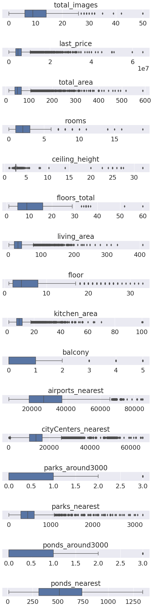
    


```python
(df_normal[df_normal['floors_total']>50])
```


<div>
<style scoped>
    .dataframe tbody tr th:only-of-type {
        vertical-align: middle;
    }

    .dataframe tbody tr th {
        vertical-align: top;
    }

    .dataframe thead th {
        text-align: right;
    }
</style>
<table border="1" class="dataframe">
  <thead>
    <tr style="text-align: right;">
      <th></th>
      <th>total_images</th>
      <th>last_price</th>
      <th>total_area</th>
      <th>first_day_exposition</th>
      <th>rooms</th>
      <th>ceiling_height</th>
      <th>floors_total</th>
      <th>living_area</th>
      <th>floor</th>
      <th>is_apartment</th>
      <th>studio</th>
      <th>open_plan</th>
      <th>kitchen_area</th>
      <th>balcony</th>
      <th>locality_name</th>
      <th>airports_nearest</th>
      <th>cityCenters_nearest</th>
      <th>parks_around3000</th>
      <th>parks_nearest</th>
      <th>ponds_around3000</th>
      <th>ponds_nearest</th>
      <th>days_exposition</th>
      <th>locality_name_without_dups</th>
    </tr>
  </thead>
  <tbody>
    <tr>
      <th>2253</th>
      <td>12</td>
      <td>3800000.0</td>
      <td>45.5</td>
      <td>2018-06-28</td>
      <td>2</td>
      <td>2.88</td>
      <td>60</td>
      <td>27.4</td>
      <td>4</td>
      <td>False</td>
      <td>False</td>
      <td>False</td>
      <td>7.4</td>
      <td>0</td>
      <td>Кронштадт</td>
      <td>67763.0</td>
      <td>49488.0</td>
      <td>2</td>
      <td>342.0</td>
      <td>3</td>
      <td>614.0</td>
      <td>166</td>
      <td>Кронштадт</td>
    </tr>
    <tr>
      <th>16731</th>
      <td>9</td>
      <td>3978000.0</td>
      <td>40.0</td>
      <td>2018-09-24</td>
      <td>1</td>
      <td>2.65</td>
      <td>52</td>
      <td>10.5</td>
      <td>18</td>
      <td>False</td>
      <td>False</td>
      <td>False</td>
      <td>14.0</td>
      <td>0</td>
      <td>Санкт-Петербург</td>
      <td>20728.0</td>
      <td>12978.0</td>
      <td>1</td>
      <td>793.0</td>
      <td>0</td>
      <td>NaN</td>
      <td>45</td>
      <td>Санкт-Петербург</td>
    </tr>
  </tbody>
</table>
</div>


```python
(df_normal[(df_normal['rooms']==0) & (~df_normal['studio'])& (~df_normal['open_plan'])])
```


<div>
<style scoped>
    .dataframe tbody tr th:only-of-type {
        vertical-align: middle;
    }

    .dataframe tbody tr th {
        vertical-align: top;
    }

    .dataframe thead th {
        text-align: right;
    }
</style>
<table border="1" class="dataframe">
  <thead>
    <tr style="text-align: right;">
      <th></th>
      <th>total_images</th>
      <th>last_price</th>
      <th>total_area</th>
      <th>first_day_exposition</th>
      <th>rooms</th>
      <th>ceiling_height</th>
      <th>floors_total</th>
      <th>living_area</th>
      <th>floor</th>
      <th>is_apartment</th>
      <th>studio</th>
      <th>open_plan</th>
      <th>kitchen_area</th>
      <th>balcony</th>
      <th>locality_name</th>
      <th>airports_nearest</th>
      <th>cityCenters_nearest</th>
      <th>parks_around3000</th>
      <th>parks_nearest</th>
      <th>ponds_around3000</th>
      <th>ponds_nearest</th>
      <th>days_exposition</th>
      <th>locality_name_without_dups</th>
    </tr>
  </thead>
  <tbody>
  </tbody>
</table>
</div>


```python
df_normal[(df_normal['last_price']<500000)]
```


<div>
<style scoped>
    .dataframe tbody tr th:only-of-type {
        vertical-align: middle;
    }

    .dataframe tbody tr th {
        vertical-align: top;
    }

    .dataframe thead th {
        text-align: right;
    }
</style>
<table border="1" class="dataframe">
  <thead>
    <tr style="text-align: right;">
      <th></th>
      <th>total_images</th>
      <th>last_price</th>
      <th>total_area</th>
      <th>first_day_exposition</th>
      <th>rooms</th>
      <th>ceiling_height</th>
      <th>floors_total</th>
      <th>living_area</th>
      <th>floor</th>
      <th>is_apartment</th>
      <th>studio</th>
      <th>open_plan</th>
      <th>kitchen_area</th>
      <th>balcony</th>
      <th>locality_name</th>
      <th>airports_nearest</th>
      <th>cityCenters_nearest</th>
      <th>parks_around3000</th>
      <th>parks_nearest</th>
      <th>ponds_around3000</th>
      <th>ponds_nearest</th>
      <th>days_exposition</th>
      <th>locality_name_without_dups</th>
    </tr>
  </thead>
  <tbody>
    <tr>
      <th>5698</th>
      <td>7</td>
      <td>450000.0</td>
      <td>42.0</td>
      <td>2017-07-31</td>
      <td>2</td>
      <td>2.60</td>
      <td>1</td>
      <td>23.0</td>
      <td>1</td>
      <td>False</td>
      <td>False</td>
      <td>False</td>
      <td>5.8</td>
      <td>0</td>
      <td>городской посёлок Будогощь</td>
      <td>NaN</td>
      <td>NaN</td>
      <td>&lt;NA&gt;</td>
      <td>NaN</td>
      <td>&lt;NA&gt;</td>
      <td>NaN</td>
      <td>233</td>
      <td>Будогощь</td>
    </tr>
    <tr>
      <th>6859</th>
      <td>6</td>
      <td>490000.0</td>
      <td>40.0</td>
      <td>2017-12-11</td>
      <td>1</td>
      <td>2.60</td>
      <td>5</td>
      <td>NaN</td>
      <td>3</td>
      <td>False</td>
      <td>False</td>
      <td>False</td>
      <td>NaN</td>
      <td>0</td>
      <td>деревня Старополье</td>
      <td>NaN</td>
      <td>NaN</td>
      <td>&lt;NA&gt;</td>
      <td>NaN</td>
      <td>&lt;NA&gt;</td>
      <td>NaN</td>
      <td>43</td>
      <td>Старополье</td>
    </tr>
    <tr>
      <th>8793</th>
      <td>7</td>
      <td>12190.0</td>
      <td>109.0</td>
      <td>2019-03-20</td>
      <td>2</td>
      <td>2.75</td>
      <td>25</td>
      <td>32.0</td>
      <td>25</td>
      <td>False</td>
      <td>False</td>
      <td>False</td>
      <td>40.5</td>
      <td>0</td>
      <td>Санкт-Петербург</td>
      <td>36421.0</td>
      <td>9176.0</td>
      <td>1</td>
      <td>805.0</td>
      <td>0</td>
      <td>NaN</td>
      <td>8</td>
      <td>Санкт-Петербург</td>
    </tr>
    <tr>
      <th>9581</th>
      <td>7</td>
      <td>450000.0</td>
      <td>43.4</td>
      <td>2018-08-31</td>
      <td>2</td>
      <td>2.60</td>
      <td>5</td>
      <td>30.3</td>
      <td>3</td>
      <td>False</td>
      <td>False</td>
      <td>False</td>
      <td>5.5</td>
      <td>0</td>
      <td>деревня Старополье</td>
      <td>NaN</td>
      <td>NaN</td>
      <td>&lt;NA&gt;</td>
      <td>NaN</td>
      <td>&lt;NA&gt;</td>
      <td>NaN</td>
      <td>96</td>
      <td>Старополье</td>
    </tr>
    <tr>
      <th>10782</th>
      <td>3</td>
      <td>490000.0</td>
      <td>29.1</td>
      <td>2016-05-05</td>
      <td>1</td>
      <td>2.50</td>
      <td>5</td>
      <td>17.0</td>
      <td>5</td>
      <td>False</td>
      <td>False</td>
      <td>False</td>
      <td>5.5</td>
      <td>0</td>
      <td>Сланцы</td>
      <td>NaN</td>
      <td>NaN</td>
      <td>&lt;NA&gt;</td>
      <td>NaN</td>
      <td>&lt;NA&gt;</td>
      <td>NaN</td>
      <td>719</td>
      <td>Сланцы</td>
    </tr>
    <tr>
      <th>14911</th>
      <td>5</td>
      <td>430000.0</td>
      <td>54.0</td>
      <td>2018-06-26</td>
      <td>2</td>
      <td>2.60</td>
      <td>3</td>
      <td>NaN</td>
      <td>3</td>
      <td>False</td>
      <td>False</td>
      <td>False</td>
      <td>NaN</td>
      <td>0</td>
      <td>посёлок станции Свирь</td>
      <td>NaN</td>
      <td>NaN</td>
      <td>&lt;NA&gt;</td>
      <td>NaN</td>
      <td>&lt;NA&gt;</td>
      <td>NaN</td>
      <td>44</td>
      <td>Свирь</td>
    </tr>
    <tr>
      <th>16032</th>
      <td>8</td>
      <td>480000.0</td>
      <td>32.0</td>
      <td>2019-01-06</td>
      <td>1</td>
      <td>2.60</td>
      <td>2</td>
      <td>16.0</td>
      <td>1</td>
      <td>False</td>
      <td>False</td>
      <td>False</td>
      <td>NaN</td>
      <td>0</td>
      <td>Сланцы</td>
      <td>NaN</td>
      <td>NaN</td>
      <td>&lt;NA&gt;</td>
      <td>NaN</td>
      <td>&lt;NA&gt;</td>
      <td>NaN</td>
      <td>83</td>
      <td>Сланцы</td>
    </tr>
    <tr>
      <th>16219</th>
      <td>14</td>
      <td>450000.0</td>
      <td>38.5</td>
      <td>2018-07-11</td>
      <td>2</td>
      <td>2.65</td>
      <td>2</td>
      <td>NaN</td>
      <td>1</td>
      <td>False</td>
      <td>False</td>
      <td>False</td>
      <td>NaN</td>
      <td>0</td>
      <td>деревня Вахнова Кара</td>
      <td>NaN</td>
      <td>NaN</td>
      <td>&lt;NA&gt;</td>
      <td>NaN</td>
      <td>&lt;NA&gt;</td>
      <td>NaN</td>
      <td>45</td>
      <td>Вахнова Кара</td>
    </tr>
    <tr>
      <th>16274</th>
      <td>18</td>
      <td>440000.0</td>
      <td>40.0</td>
      <td>2018-07-10</td>
      <td>1</td>
      <td>2.60</td>
      <td>5</td>
      <td>NaN</td>
      <td>1</td>
      <td>False</td>
      <td>False</td>
      <td>False</td>
      <td>NaN</td>
      <td>0</td>
      <td>деревня Старополье</td>
      <td>NaN</td>
      <td>NaN</td>
      <td>&lt;NA&gt;</td>
      <td>NaN</td>
      <td>&lt;NA&gt;</td>
      <td>NaN</td>
      <td>45</td>
      <td>Старополье</td>
    </tr>
    <tr>
      <th>17456</th>
      <td>7</td>
      <td>430000.0</td>
      <td>30.4</td>
      <td>2019-04-22</td>
      <td>1</td>
      <td>2.60</td>
      <td>2</td>
      <td>16.0</td>
      <td>1</td>
      <td>False</td>
      <td>False</td>
      <td>False</td>
      <td>6.0</td>
      <td>0</td>
      <td>Сланцы</td>
      <td>NaN</td>
      <td>NaN</td>
      <td>&lt;NA&gt;</td>
      <td>NaN</td>
      <td>&lt;NA&gt;</td>
      <td>NaN</td>
      <td>&lt;NA&gt;</td>
      <td>Сланцы</td>
    </tr>
    <tr>
      <th>17676</th>
      <td>0</td>
      <td>450000.0</td>
      <td>36.5</td>
      <td>2018-02-01</td>
      <td>1</td>
      <td>2.60</td>
      <td>5</td>
      <td>17.3</td>
      <td>4</td>
      <td>False</td>
      <td>False</td>
      <td>False</td>
      <td>8.5</td>
      <td>1</td>
      <td>деревня Ям-Тесово</td>
      <td>NaN</td>
      <td>NaN</td>
      <td>&lt;NA&gt;</td>
      <td>NaN</td>
      <td>&lt;NA&gt;</td>
      <td>NaN</td>
      <td>120</td>
      <td>Ям-Тесово</td>
    </tr>
    <tr>
      <th>18867</th>
      <td>1</td>
      <td>470000.0</td>
      <td>41.0</td>
      <td>2018-02-11</td>
      <td>1</td>
      <td>2.60</td>
      <td>5</td>
      <td>32.0</td>
      <td>3</td>
      <td>False</td>
      <td>False</td>
      <td>False</td>
      <td>9.0</td>
      <td>0</td>
      <td>деревня Выскатка</td>
      <td>NaN</td>
      <td>NaN</td>
      <td>&lt;NA&gt;</td>
      <td>NaN</td>
      <td>&lt;NA&gt;</td>
      <td>NaN</td>
      <td>46</td>
      <td>Выскатка</td>
    </tr>
    <tr>
      <th>21912</th>
      <td>0</td>
      <td>470000.0</td>
      <td>37.0</td>
      <td>2018-02-18</td>
      <td>1</td>
      <td>2.60</td>
      <td>3</td>
      <td>NaN</td>
      <td>3</td>
      <td>False</td>
      <td>False</td>
      <td>False</td>
      <td>NaN</td>
      <td>0</td>
      <td>поселок Совхозный</td>
      <td>NaN</td>
      <td>NaN</td>
      <td>&lt;NA&gt;</td>
      <td>NaN</td>
      <td>&lt;NA&gt;</td>
      <td>NaN</td>
      <td>45</td>
      <td>Совхозный</td>
    </tr>
    <tr>
      <th>23484</th>
      <td>11</td>
      <td>470000.0</td>
      <td>44.5</td>
      <td>2018-07-02</td>
      <td>2</td>
      <td>2.60</td>
      <td>2</td>
      <td>28.0</td>
      <td>2</td>
      <td>False</td>
      <td>False</td>
      <td>False</td>
      <td>7.5</td>
      <td>0</td>
      <td>Сланцы</td>
      <td>NaN</td>
      <td>NaN</td>
      <td>&lt;NA&gt;</td>
      <td>NaN</td>
      <td>&lt;NA&gt;</td>
      <td>NaN</td>
      <td>298</td>
      <td>Сланцы</td>
    </tr>
  </tbody>
</table>
</div>


```python
df_normal[df_normal['ceiling_height']<2]
```


<div>
<style scoped>
    .dataframe tbody tr th:only-of-type {
        vertical-align: middle;
    }

    .dataframe tbody tr th {
        vertical-align: top;
    }

    .dataframe thead th {
        text-align: right;
    }
</style>
<table border="1" class="dataframe">
  <thead>
    <tr style="text-align: right;">
      <th></th>
      <th>total_images</th>
      <th>last_price</th>
      <th>total_area</th>
      <th>first_day_exposition</th>
      <th>rooms</th>
      <th>ceiling_height</th>
      <th>floors_total</th>
      <th>living_area</th>
      <th>floor</th>
      <th>is_apartment</th>
      <th>studio</th>
      <th>open_plan</th>
      <th>kitchen_area</th>
      <th>balcony</th>
      <th>locality_name</th>
      <th>airports_nearest</th>
      <th>cityCenters_nearest</th>
      <th>parks_around3000</th>
      <th>parks_nearest</th>
      <th>ponds_around3000</th>
      <th>ponds_nearest</th>
      <th>days_exposition</th>
      <th>locality_name_without_dups</th>
    </tr>
  </thead>
  <tbody>
    <tr>
      <th>5712</th>
      <td>5</td>
      <td>1500000.0</td>
      <td>42.8</td>
      <td>2017-08-14</td>
      <td>2</td>
      <td>1.20</td>
      <td>2</td>
      <td>27.5</td>
      <td>1</td>
      <td>False</td>
      <td>False</td>
      <td>False</td>
      <td>5.20</td>
      <td>0</td>
      <td>городской посёлок Мга</td>
      <td>NaN</td>
      <td>NaN</td>
      <td>&lt;NA&gt;</td>
      <td>NaN</td>
      <td>&lt;NA&gt;</td>
      <td>NaN</td>
      <td>248</td>
      <td>Мга</td>
    </tr>
    <tr>
      <th>16934</th>
      <td>5</td>
      <td>4100000.0</td>
      <td>40.0</td>
      <td>2017-10-17</td>
      <td>1</td>
      <td>1.75</td>
      <td>37</td>
      <td>17.4</td>
      <td>5</td>
      <td>False</td>
      <td>False</td>
      <td>False</td>
      <td>8.34</td>
      <td>0</td>
      <td>Санкт-Петербург</td>
      <td>18732.0</td>
      <td>20444.0</td>
      <td>0</td>
      <td>NaN</td>
      <td>3</td>
      <td>80.0</td>
      <td>71</td>
      <td>Санкт-Петербург</td>
    </tr>
    <tr>
      <th>22590</th>
      <td>16</td>
      <td>6000000.0</td>
      <td>55.0</td>
      <td>2018-10-31</td>
      <td>2</td>
      <td>1.00</td>
      <td>12</td>
      <td>32.4</td>
      <td>7</td>
      <td>False</td>
      <td>False</td>
      <td>False</td>
      <td>10.00</td>
      <td>0</td>
      <td>Санкт-Петербург</td>
      <td>33053.0</td>
      <td>14217.0</td>
      <td>2</td>
      <td>293.0</td>
      <td>2</td>
      <td>289.0</td>
      <td>13</td>
      <td>Санкт-Петербург</td>
    </tr>
  </tbody>
</table>
</div>


```python
min(df_normal['floors_total'])
```


    1


* `total_images`, `balcony`, `floor` - выглядят вполне реалистично, не удаляем выбросы
* `total_area`, `rooms`, `living_area`, `kitchen_area` - так как мы сосредоточены на анализе рынка обычной недвижимости в этом датафрейме сейчас то из этого датафрейма уберем жилье явно иного класса (элитное жилье) руководствуясь отсечкой по усам.
* `last_price` - нашлась квартира стоимостью менее 13.000 рублей. такого точно не может быть, удалим и ее. квартиры выше чем правый ус удалим также руководствуюясь логикой из предыдущего пункта.
* `ceiling_height` - удалим объекты со значениями высоты потолков менее 2х метров (3 шт) и в интервале [6;20], а значения выше 20 поделим на 10.
* `floors_total` - домов более 50 этажей в Питере не бывает. скорее всего опечатка, таких объектов всего 2, удалим эти объекты, так как гадать реальную этажность для столь незначительного количества данных не имеет смысла.
* `airports_nearest`, `cityCenters_nearest`, `parks_nearest`, `ponds_nearest`, `ponds_around3000`, `parks_around3000` - вычислены автоматически, не будем удалять выбросы такого типа так как они отражают реальную суть наблюдаемого явления и будут полезны при анализе.
* `days_exposition` - не будем трогать. выбросы там критически нужны для будущего анализа, пусть даже подготовленного не нами.

Отметим, что мы не удаляем объекты с подозрительно на первый взгляд маленьким количеством комнат (0). Предварительно мы проверили, что все такие квартиры или являются студиями или являются квартирами со свободной планировкой.

Приступим к намеченному плану действий


```python
def outlier_treatment(datacolumn):
    sorted(datacolumn)
    Q1,Q3 = np.percentile(datacolumn , [25,75])
    IQR = Q3-Q1
    lower_range = Q1 - (1.5 * IQR)
    upper_range = Q3 + (1.5 * IQR)
    return lower_range,upper_range
```


```python
#НЕ ИСПОЛНЯТЬ БОЛЕЕ 1 РАЗА!!!!!!!!!!!!!!!!!!!!!!!!!!!!!!!!!!!!!!!!!!!
remove_IRQ_outliers_columns = ['total_area', 'rooms', 'living_area', 'kitchen_area', 'last_price']
#remove_IRQ_outliers_columns = ['total_area', 'rooms', 'last_price']
for column in remove_IRQ_outliers_columns:
    lowerbound,upperbound = outlier_treatment(df_normal[column])
    df_normal.drop(df_normal[ 
        (df_normal[column] > upperbound) |
        (df_normal[column] < lowerbound) ].index , inplace=True)

```


```python
df_normal = df_normal[((df_normal['ceiling_height']>2)&(df_normal['ceiling_height']<6)) |
                          (df_normal['ceiling_height']>20)]
df_normal['ceiling_height'] = df_normal['ceiling_height'].apply(lambda x: x/10.0 if x>20 else x)

```


```python
df_normal = df_normal[df_normal['floors_total']<50]
```

Посмотрим на очищенные данные с выбросами, которые мы не собираемся удалять так как они могут быть полезны для последующего анализа ибо хранят в себе потенциально интересную информацию

<div class="alert alert-info">
<b>После замены пропусков в высотке потолков медианным значением - ушла и проблема. Новая ячейка с кододм v1:</b>
<br>
</div>


```python
removed_amount = old_size_normal-df_normal.shape[0]
removed_amount_percent = 100*removed_amount/old_size_normal
print(f'Было удалено {removed_amount} объектов, что составляет {removed_amount_percent:.2f}% от общего объема датасета')
```

    Было удалено 2000 объектов, что составляет 9.07% от общего объема датасета


<div class="alert alert-info">
<b>Конец новых ячеек с кодом v1:</b>
<br>
</div>


```python
numeric_columns = []
for column in df_normal.columns:
    if is_numeric_dtype(df_normal[column]) and not is_bool_dtype(df_normal[column]):
        numeric_columns.append(column)
#numeric_columns=['total_images', 'last_price', 'total_area', 'rooms', 'ceiling_height', 'floors_total', 'living_area', 'floor', 'kitchen_area', 'balcony', 'airports_nearest', 'cityCenters_nearest', 'parks_around3000', 'parks_nearest', 'ponds_around3000', 'ponds_nearest']

fig, axes = plt.subplots(nrows=len(numeric_columns),ncols=1, figsize=(len(numeric_columns)/2,30))

# Create the boxplot with Seaborn
for column, axis in zip(numeric_columns, axes):
        sns.boxplot(x=np.array(df_normal[column].dropna()), ax=axis) 
        axis.set_title(column)

# Show the plot
plt.tight_layout()
plt.show()
```


    
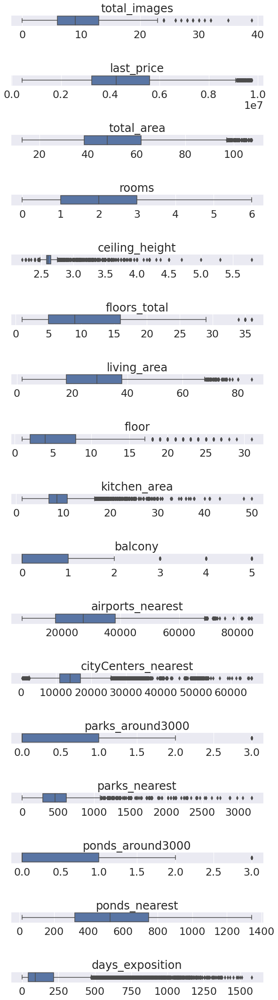
    


```python
df_normal.describe()
```


<div>
<style scoped>
    .dataframe tbody tr th:only-of-type {
        vertical-align: middle;
    }

    .dataframe tbody tr th {
        vertical-align: top;
    }

    .dataframe thead th {
        text-align: right;
    }
</style>
<table border="1" class="dataframe">
  <thead>
    <tr style="text-align: right;">
      <th></th>
      <th>total_images</th>
      <th>last_price</th>
      <th>total_area</th>
      <th>rooms</th>
      <th>ceiling_height</th>
      <th>floors_total</th>
      <th>living_area</th>
      <th>floor</th>
      <th>kitchen_area</th>
      <th>balcony</th>
      <th>airports_nearest</th>
      <th>cityCenters_nearest</th>
      <th>parks_around3000</th>
      <th>parks_nearest</th>
      <th>ponds_around3000</th>
      <th>ponds_nearest</th>
      <th>days_exposition</th>
    </tr>
  </thead>
  <tbody>
    <tr>
      <th>count</th>
      <td>20047.000000</td>
      <td>2.004700e+04</td>
      <td>20047.000000</td>
      <td>20047.000000</td>
      <td>20047.000000</td>
      <td>20047.000000</td>
      <td>18515.000000</td>
      <td>20047.000000</td>
      <td>18156.000000</td>
      <td>20047.000000</td>
      <td>14624.000000</td>
      <td>14634.000000</td>
      <td>14634.000000</td>
      <td>5905.000000</td>
      <td>14634.000000</td>
      <td>6837.000000</td>
      <td>17695.000000</td>
    </tr>
    <tr>
      <th>mean</th>
      <td>9.609368</td>
      <td>4.517468e+06</td>
      <td>51.458862</td>
      <td>1.891156</td>
      <td>2.642283</td>
      <td>10.691924</td>
      <td>29.576896</td>
      <td>5.823415</td>
      <td>9.311244</td>
      <td>0.588517</td>
      <td>29075.033712</td>
      <td>15482.659628</td>
      <td>0.537037</td>
      <td>483.336664</td>
      <td>0.674935</td>
      <td>535.997660</td>
      <td>169.248940</td>
    </tr>
    <tr>
      <th>std</th>
      <td>5.483406</td>
      <td>1.855375e+06</td>
      <td>16.492308</td>
      <td>0.873139</td>
      <td>0.171954</td>
      <td>6.591936</td>
      <td>12.083204</td>
      <td>4.869569</td>
      <td>3.482601</td>
      <td>0.926423</td>
      <td>13178.288512</td>
      <td>8511.010313</td>
      <td>0.753335</td>
      <td>316.698472</td>
      <td>0.864996</td>
      <td>277.120951</td>
      <td>205.987066</td>
    </tr>
    <tr>
      <th>min</th>
      <td>0.000000</td>
      <td>4.300000e+05</td>
      <td>13.000000</td>
      <td>0.000000</td>
      <td>2.200000</td>
      <td>1.000000</td>
      <td>2.000000</td>
      <td>1.000000</td>
      <td>1.300000</td>
      <td>0.000000</td>
      <td>6450.000000</td>
      <td>329.000000</td>
      <td>0.000000</td>
      <td>1.000000</td>
      <td>0.000000</td>
      <td>16.000000</td>
      <td>1.000000</td>
    </tr>
    <tr>
      <th>25%</th>
      <td>6.000000</td>
      <td>3.250000e+06</td>
      <td>38.500000</td>
      <td>1.000000</td>
      <td>2.580000</td>
      <td>5.000000</td>
      <td>18.000000</td>
      <td>2.000000</td>
      <td>7.000000</td>
      <td>0.000000</td>
      <td>17845.000000</td>
      <td>11086.000000</td>
      <td>0.000000</td>
      <td>289.000000</td>
      <td>0.000000</td>
      <td>320.000000</td>
      <td>43.000000</td>
    </tr>
    <tr>
      <th>50%</th>
      <td>9.000000</td>
      <td>4.250000e+06</td>
      <td>48.000000</td>
      <td>2.000000</td>
      <td>2.600000</td>
      <td>9.000000</td>
      <td>29.000000</td>
      <td>4.000000</td>
      <td>8.700000</td>
      <td>0.000000</td>
      <td>27358.500000</td>
      <td>13962.500000</td>
      <td>0.000000</td>
      <td>455.000000</td>
      <td>0.000000</td>
      <td>525.000000</td>
      <td>90.000000</td>
    </tr>
    <tr>
      <th>75%</th>
      <td>13.000000</td>
      <td>5.600000e+06</td>
      <td>61.900000</td>
      <td>3.000000</td>
      <td>2.650000</td>
      <td>16.000000</td>
      <td>38.000000</td>
      <td>8.000000</td>
      <td>10.840000</td>
      <td>1.000000</td>
      <td>38195.000000</td>
      <td>16932.000000</td>
      <td>1.000000</td>
      <td>610.000000</td>
      <td>1.000000</td>
      <td>746.000000</td>
      <td>216.000000</td>
    </tr>
    <tr>
      <th>max</th>
      <td>39.000000</td>
      <td>9.753380e+06</td>
      <td>107.400000</td>
      <td>6.000000</td>
      <td>5.800000</td>
      <td>36.000000</td>
      <td>85.000000</td>
      <td>31.000000</td>
      <td>50.000000</td>
      <td>5.000000</td>
      <td>84869.000000</td>
      <td>65968.000000</td>
      <td>3.000000</td>
      <td>3190.000000</td>
      <td>3.000000</td>
      <td>1344.000000</td>
      <td>1580.000000</td>
    </tr>
  </tbody>
</table>
</div>


```python
df_normal.info()
```

    <class 'pandas.core.frame.DataFrame'>
    Int64Index: 20047 entries, 1 to 23698
    Data columns (total 23 columns):
     #   Column                      Non-Null Count  Dtype         
    ---  ------                      --------------  -----         
     0   total_images                20047 non-null  int64         
     1   last_price                  20047 non-null  float64       
     2   total_area                  20047 non-null  float64       
     3   first_day_exposition        20047 non-null  datetime64[ns]
     4   rooms                       20047 non-null  int64         
     5   ceiling_height              20047 non-null  float64       
     6   floors_total                20047 non-null  Int64         
     7   living_area                 18515 non-null  float64       
     8   floor                       20047 non-null  int64         
     9   is_apartment                20047 non-null  bool          
     10  studio                      20047 non-null  bool          
     11  open_plan                   20047 non-null  bool          
     12  kitchen_area                18156 non-null  float64       
     13  balcony                     20047 non-null  Int64         
     14  locality_name               20047 non-null  object        
     15  airports_nearest            14624 non-null  float64       
     16  cityCenters_nearest         14634 non-null  float64       
     17  parks_around3000            14634 non-null  Int64         
     18  parks_nearest               5905 non-null   float64       
     19  ponds_around3000            14634 non-null  Int64         
     20  ponds_nearest               6837 non-null   float64       
     21  days_exposition             17695 non-null  Int64         
     22  locality_name_without_dups  20047 non-null  object        
    dtypes: Int64(5), bool(3), datetime64[ns](1), float64(9), int64(3), object(2)
    memory usage: 3.4+ MB


```python
df_elite.info()
```

    <class 'pandas.core.frame.DataFrame'>
    Int64Index: 1641 entries, 3 to 23625
    Data columns (total 23 columns):
     #   Column                      Non-Null Count  Dtype         
    ---  ------                      --------------  -----         
     0   total_images                1641 non-null   int64         
     1   last_price                  1641 non-null   float64       
     2   total_area                  1641 non-null   float64       
     3   first_day_exposition        1641 non-null   datetime64[ns]
     4   rooms                       1641 non-null   int64         
     5   ceiling_height              1104 non-null   float64       
     6   floors_total                1641 non-null   Int64         
     7   living_area                 1467 non-null   float64       
     8   floor                       1641 non-null   int64         
     9   is_apartment                1641 non-null   bool          
     10  studio                      1641 non-null   bool          
     11  open_plan                   1641 non-null   bool          
     12  kitchen_area                1462 non-null   float64       
     13  balcony                     1641 non-null   Int64         
     14  locality_name               1641 non-null   object        
     15  airports_nearest            1604 non-null   float64       
     16  cityCenters_nearest         1616 non-null   float64       
     17  parks_around3000            1616 non-null   Int64         
     18  parks_nearest               1070 non-null   float64       
     19  ponds_around3000            1616 non-null   Int64         
     20  ponds_nearest               1131 non-null   float64       
     21  days_exposition             1230 non-null   Int64         
     22  locality_name_without_dups  1641 non-null   object        
    dtypes: Int64(5), bool(3), datetime64[ns](1), float64(9), int64(3), object(2)
    memory usage: 282.0+ KB


```python
df_elite.describe()
```


<div>
<style scoped>
    .dataframe tbody tr th:only-of-type {
        vertical-align: middle;
    }

    .dataframe tbody tr th {
        vertical-align: top;
    }

    .dataframe thead th {
        text-align: right;
    }
</style>
<table border="1" class="dataframe">
  <thead>
    <tr style="text-align: right;">
      <th></th>
      <th>total_images</th>
      <th>last_price</th>
      <th>total_area</th>
      <th>rooms</th>
      <th>ceiling_height</th>
      <th>floors_total</th>
      <th>living_area</th>
      <th>floor</th>
      <th>kitchen_area</th>
      <th>balcony</th>
      <th>airports_nearest</th>
      <th>cityCenters_nearest</th>
      <th>parks_around3000</th>
      <th>parks_nearest</th>
      <th>ponds_around3000</th>
      <th>ponds_nearest</th>
      <th>days_exposition</th>
    </tr>
  </thead>
  <tbody>
    <tr>
      <th>count</th>
      <td>1641.000000</td>
      <td>1.641000e+03</td>
      <td>1641.000000</td>
      <td>1641.000000</td>
      <td>1104.000000</td>
      <td>1641.000000</td>
      <td>1467.000000</td>
      <td>1641.000000</td>
      <td>1462.000000</td>
      <td>1641.00000</td>
      <td>1604.000000</td>
      <td>1616.000000</td>
      <td>1616.000000</td>
      <td>1070.000000</td>
      <td>1616.000000</td>
      <td>1131.000000</td>
      <td>1230.000000</td>
    </tr>
    <tr>
      <th>mean</th>
      <td>11.942718</td>
      <td>2.344151e+07</td>
      <td>97.393309</td>
      <td>2.490555</td>
      <td>3.146540</td>
      <td>10.524680</td>
      <td>51.968119</td>
      <td>6.340646</td>
      <td>18.095978</td>
      <td>0.60390</td>
      <td>27166.654613</td>
      <td>7639.637376</td>
      <td>1.029084</td>
      <td>527.502804</td>
      <td>1.341584</td>
      <td>441.494253</td>
      <td>240.628455</td>
    </tr>
    <tr>
      <th>std</th>
      <td>6.379876</td>
      <td>3.529292e+07</td>
      <td>70.022747</td>
      <td>1.338479</td>
      <td>3.029577</td>
      <td>6.023493</td>
      <td>40.992420</td>
      <td>4.743711</td>
      <td>11.679070</td>
      <td>1.04138</td>
      <td>8949.119710</td>
      <td>5441.519981</td>
      <td>0.944803</td>
      <td>441.650848</td>
      <td>1.147199</td>
      <td>270.135778</td>
      <td>271.615358</td>
    </tr>
    <tr>
      <th>min</th>
      <td>0.000000</td>
      <td>2.400000e+06</td>
      <td>12.000000</td>
      <td>0.000000</td>
      <td>2.500000</td>
      <td>2.000000</td>
      <td>3.000000</td>
      <td>1.000000</td>
      <td>2.000000</td>
      <td>0.00000</td>
      <td>0.000000</td>
      <td>181.000000</td>
      <td>0.000000</td>
      <td>4.000000</td>
      <td>0.000000</td>
      <td>13.000000</td>
      <td>2.000000</td>
    </tr>
    <tr>
      <th>25%</th>
      <td>7.000000</td>
      <td>9.300000e+06</td>
      <td>53.000000</td>
      <td>2.000000</td>
      <td>2.800000</td>
      <td>6.000000</td>
      <td>25.470000</td>
      <td>3.000000</td>
      <td>11.000000</td>
      <td>0.00000</td>
      <td>22407.750000</td>
      <td>4523.500000</td>
      <td>0.000000</td>
      <td>257.750000</td>
      <td>0.000000</td>
      <td>213.000000</td>
      <td>60.000000</td>
    </tr>
    <tr>
      <th>50%</th>
      <td>12.000000</td>
      <td>1.489000e+07</td>
      <td>80.000000</td>
      <td>2.000000</td>
      <td>3.000000</td>
      <td>9.000000</td>
      <td>40.000000</td>
      <td>5.000000</td>
      <td>14.625000</td>
      <td>0.00000</td>
      <td>25988.000000</td>
      <td>6040.500000</td>
      <td>1.000000</td>
      <td>456.000000</td>
      <td>1.000000</td>
      <td>427.000000</td>
      <td>134.500000</td>
    </tr>
    <tr>
      <th>75%</th>
      <td>18.000000</td>
      <td>2.500000e+07</td>
      <td>118.000000</td>
      <td>3.000000</td>
      <td>3.160000</td>
      <td>15.000000</td>
      <td>63.100000</td>
      <td>8.000000</td>
      <td>21.000000</td>
      <td>1.00000</td>
      <td>32359.000000</td>
      <td>10330.500000</td>
      <td>2.000000</td>
      <td>630.000000</td>
      <td>2.000000</td>
      <td>639.500000</td>
      <td>335.750000</td>
    </tr>
    <tr>
      <th>max</th>
      <td>50.000000</td>
      <td>7.630000e+08</td>
      <td>900.000000</td>
      <td>12.000000</td>
      <td>100.000000</td>
      <td>26.000000</td>
      <td>409.700000</td>
      <td>25.000000</td>
      <td>112.000000</td>
      <td>5.00000</td>
      <td>73391.000000</td>
      <td>54490.000000</td>
      <td>3.000000</td>
      <td>2905.000000</td>
      <td>3.000000</td>
      <td>1293.000000</td>
      <td>1572.000000</td>
    </tr>
  </tbody>
</table>
</div>


<div class="alert alert-danger">
<b>❌ Комментарий ревьюера v1:</b> 
<br>В итоге ты отбросил около 50% от всех данных, а доступимо отбросить не более 10%. Основные столбцы где стоит поработать с выбросами это стоимость квартиры, высота потолков, количество комнат и общая площадь. Остальные можно не трогать. Если ты всё-таки хочешь обработать все столбцы, то уменьши количество отбрасываемых данных до quantile(0.005) и quantile(0.995). Вне зависимости от того способа, который ты выберешь не забудь проверить количество отбрасываемых данных. С этим поможет следующая команда

	new_data.shape[0] / old_data.shape[0]
    
<br>Также обрати внимание, что часть данных можно потерять, делая срез и теряя данные с пропусками.
</div>


<div class="alert alert-success">
<b>✔️ Комментарий ревьюера v2:</b>
<br>Отлично! Теперь всё верно)
</div>

### Посчитайте и добавьте в таблицу новые столбцы


```python
def floor_type_detect(row):
    if row['floor'] == row['floors_total']:
        return 'последний'
    elif row['floor'] == 1:
        return 'первый'
    else:
        return 'другой'
```


```python
df_normal['sqm_price'] = df_normal['last_price'] / df_normal['total_area']
df_normal['first_day_expo_weekday'] = df_normal.first_day_exposition.dt.weekday
df_normal['first_day_expo_month'] = df_normal.first_day_exposition.dt.month
df_normal['first_day_expo_year'] = df_normal.first_day_exposition.dt.year
df_normal['floor_type'] = df_normal.apply(floor_type_detect, axis=1)
df_normal['cityCenters_nearest_km'] = df_normal.apply(lambda x: round(x['cityCenters_nearest']/1000, 0), axis=1)

```

В этом шаге мы вычислили 
* цену одного квадратного метра (`sqm_price`)
* день недели публикации объявления (`first_day_expo_weekday`)
* месяц публикации объявления (`first_day_expo_month`)
* год публикации объявления (`first_day_expo_year`)
* тип этажа квартиры (`floor_type`)
* расстояние до центра в километрах с точностью до 2х знаков после запятой (`cityCenters_nearest_km`)

<div class="alert alert-success">
<b>✔️ Комментарий ревьюера v1:</b> 
<br>Все необходимые колонки добавлены. Идём дальше)
</div>

### Проведите исследовательский анализ данных

**Посмотрим на распределение общей площади объектов**


```python
df_normal['total_area'].hist(bins=50, facecolor='blue', edgecolor='black', grid=True);
plt.xlabel('Total area');
plt.ylabel('No of objects');
plt.title('Total area Distribution Histogram');
```


    
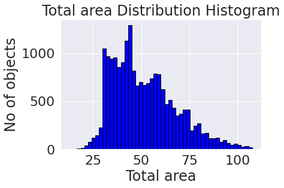
    


Отчетливо виден мультимодальный характер распределения. Попробуем сделать предполдожение, что этот характер связан с тем, что квартиры с разным количеством комнат имеют различные характерные площади которые и представлены на гистограмме итоговой площади пиковыми значениями. Посмотрим на то как распределена общая площадь по квартирам с различным числом комнат.


```python

fig=plt.figure(figsize=(28,24))
for room in range(1,7):
    plt.subplot(3,2,room)
    plt.xlabel('Total area')
    plt.ylabel('No of objects')
    plt.title(f'Total area Distribution Histogram, rooms={room}')
    plt.hist(data=df_normal[df_normal['rooms']==room], x='total_area', bins=50, facecolor='blue', edgecolor='black')
```


    
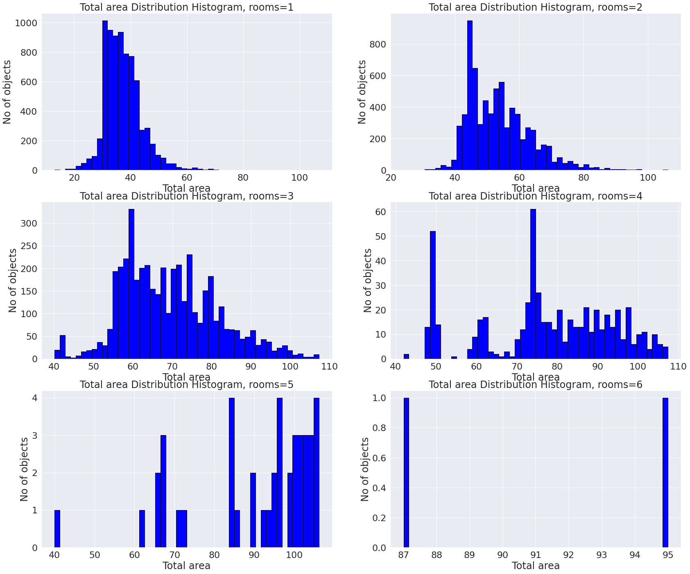
    


По крайней мере мы видим что первый пик на общей гистограмме был обусловлен многомодальностью принесенной однокомнатными квартирами. Для двухкомнатных и трехкомнатных квартир тоже наблюдается то что количество комнат обусловливало многомодальность на гистограмме общей площади. ~(27, 43, 57) - характерные площади для 1-2-3 комнатных квартир соответственно, что находит свое отражение на общей гистограмме представленной выше. влияние 4х и более комнатных квартир на общую гистограмму оценить сложно так как количество таких объектов несущественно для обнаруженгия влияния на общую гистограмму.

**Посмотрим на распределение жилой площади объектов**


```python
df_normal['living_area'].hist(bins=50, facecolor='blue', edgecolor='black', grid=True);
plt.xlabel('Living area');
plt.ylabel('No of objects');
plt.title('Living area Distribution Histogram');
```


    
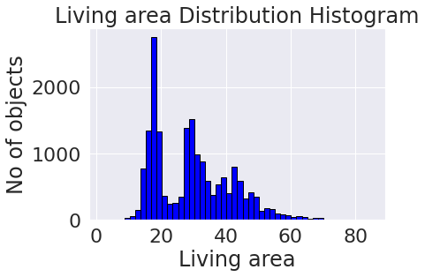
    


Наблюдается очевидно ситуация идентичная общей площади. Мультимодальность распределения объясняется различным количеством комнат и характерных площпдей жилой площади для таких квартир.

**Посмотрим на распределение площади кухонь объектов**


```python
(df_normal['kitchen_area']).hist(bins=30, facecolor='blue', edgecolor='black', grid=True);
plt.xlabel('Kitchen area');
plt.ylabel('No of objects');
plt.title('Kitchen area Distribution Histogram');
```


    
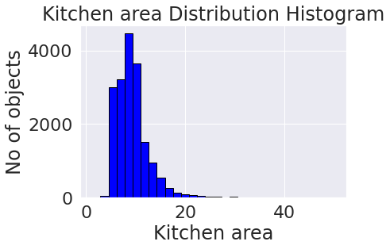
    


Наблюдается одномодальное распределение с вытянутым вправо краем (что неудивительно так как в нашу выборку могли попасть квартиры нестандартной планировки, элитные). Посмотрим на распределние логарифма площади кухни 


```python
np.log(df_normal['kitchen_area']).hist(bins=30, facecolor='blue', edgecolor='black', grid=True);
plt.xlabel('Kitchen area');
plt.ylabel('No of objects');
plt.title('Logarithm of Kitchen area Distribution Histogram');
```


    
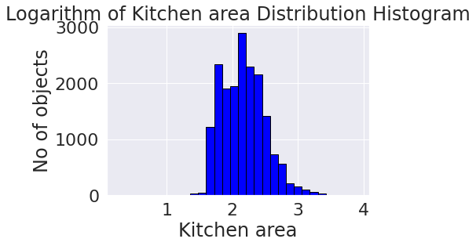
    


Можно сделать вывод что площадь кухни распределена логнормаьно. В нашу выборку попали самые разные объекты хоть мы и пытались в этот датасет включить только обычные квартиры, но объекты с необычной планировкой все таки бывают хоть и не всегда элитные или дорогие.


```python
med_price_big_kitchen = df_normal[df_normal['kitchen_area']>35].last_price.median()
print('Медианная стоимость жилья с большими (более 35 кв.м.) кухнями:', round(med_price_big_kitchen/1e6,2), 'млн. руб.')
```

    Медианная стоимость жилья с большими (более 35 кв.м.) кухнями: 7.35 млн. руб.


Судя по цене нельзя сказать что квартиры с кухнями более 35 кв.м. являются особо элитными.

**Посмотрим на распределение цены объектов**


```python
(df_normal['last_price']/1e6).hist(bins=50, facecolor='blue', edgecolor='black', grid=True);
plt.xlabel('Final price, in millions');
plt.ylabel('No of objects');
plt.title('Final price Distribution Histogram');
```


    
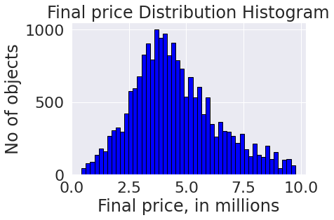
    


<div class="alert alert-warning">
<b>⚠️ Комментарий ревьюера v1:</b> 
<br>Тут можно разделить все значения в столбце last_price на 1 млн, чтобы они пришли в более понятный вид)
</div>

Можем наблюдать, что за исключением некоторых пиков мы получили распределение близкое к нормальному с одной модой. Этому способствовало как то, что мы разделяли жилье на обычное и элитное по цене за квадратный метр так и то, что мы  отбрасывали выбросы на предыдущем шаге.

**Посмотрим на распределение количества комнат у объектов**


```python
(df_normal['rooms']).hist(bins=30, facecolor='blue', edgecolor='black', grid=True);
plt.xlabel('Rooms');
plt.ylabel('No of objects');
plt.title('Rooms Distribution Histogram');
```


    
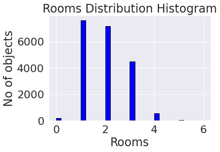
    


Мы получили вполне ожидаемый результат (квартрир без комнат (студий, свободных планировок и тд)) - не то чтоб очень много. А вот чего действительно много так это однушек, двушек и трешек. 4х комнатные квартиры хоть и присутствуют в достаточном объеме, но не делают уже большой погоды в этом датасете, равно как и более многокомнатные квартиры. Самые популярные во всех практически городах это однушки и двушки, что ожидаемо)

**Посмотрим на распределение высоты потолков у объектов**


```python
(df_normal['ceiling_height']).hist(bins=30, facecolor='blue', edgecolor='black', grid=True);
plt.xlabel('Ceiling height');
plt.ylabel('No of objects');
plt.title('Ceiling height Distribution Histogram');
```


    
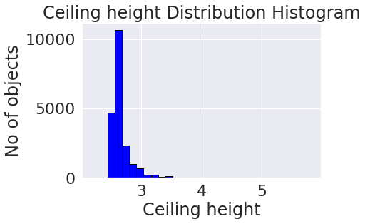
    


```python
(df_normal['ceiling_height']).value_counts().sort_values(ascending=False).head(5)
```


    2.60    9540
    2.50    3444
    2.70    1377
    2.55     963
    2.75     738
    Name: ceiling_height, dtype: int64


Несложно заметить что самый популярная высота потолков в питере для обычного жилья составляет 2,5 метра. Это вполне ожидаемо, так как минимальная высота потолков по СНиПам составляет 2,4 метра=)

**Важно!!**

<div class="alert alert-info">
<b>Так как мы заменяли пропуски высоты потолков медианным значением то получили, что самая популярная высота 2.6м - это исказило наши выводы так как мы искуственно вставили во множество квартир неподходящее значение и лишь одно успокаивает меня - ввиду малой величины разброса (стандартного отклонения) удалось избежать большой ошибки при заполнении пропусков - от оригинального значения отличие на 10 см, что не очень критично. и теперь наиболее часто встречаемые квартиры имеют высоту 2.6м а не 2.5 как ранее.:</b>
<br>
</div>

**Посмотрим на распределение этажей квартир**


```python
(df_normal['floor']).hist(bins=29, facecolor='blue', edgecolor='black', grid=True);
plt.xlabel('Floor');
plt.ylabel('No of objects');
plt.title('Floor Distribution Histogram');
```


    
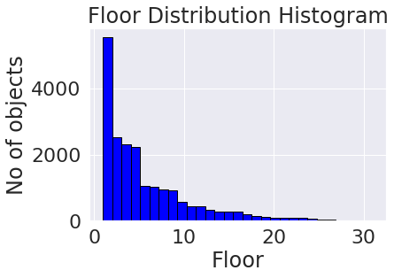
    


После 5 и 9 этажа мы видим спад так как в стране у нас очень много 5 и 9 этажных домов. Однако есть и одноэтажные дома в России. Посмотрим сколько одноэтажных домов в нашем датасете. 


```python
buildings_1_floor = len(df_normal[df_normal['floors_total']==1])
print(f'В датасете {buildings_1_floor} одноэтажных зданий')
```

    В датасете 24 одноэтажных зданий


<div class="alert alert-info">
<b>Новые ячейки с кодом v1:</b>
<br>
</div>

Проверим есть ли пик после 1 этажа хотя бы на эти 24 дома


```python
(df_normal['floor']).hist(range=(1,6), facecolor='blue', edgecolor='black', grid=True);
plt.xlabel('Floor');
plt.ylabel('No of objects');
plt.title('Floor Distribution Histogram');
```


    
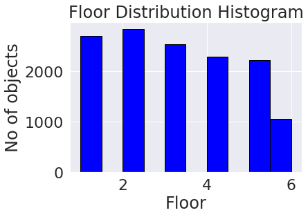
    


<div class="alert alert-info">
<b>Конец новых ячеек с кодом v1:</b>
<br>
</div>

Сказать что 24 одноэтажных здания должны менять картину в датасете невозможно. Однако почему же квартир на 1ом этаже меньше чем на втором продается? Постойте! У нас же развита модель того, что на первых этажах часто размещаются всякие магазинчики и кафешки, которые съедают площадь домов на первых этажах! Возможно с этим связан и наш пик на втором этаже у гистограммы!

**Посмотрим на распределение типов этажей квартир**


```python
(df_normal['floor_type']).hist(bins=29, facecolor='blue', edgecolor='black', grid=True)
plt.xlabel('Floor Type')
plt.ylabel('No of objects')
plt.title('Floor Type Distribution Histogram');
```


    

    


```python
(df_normal['floor_type']).value_counts()
```


    другой       14552
    последний     2816
    первый        2679
    Name: floor_type, dtype: int64


Первых и последних этажей примерно равное количество, но первых чуточку меньше. Разница, возможно, опять вызвана тем, что на первых этажах зачастую находится коммерческая недвижимость

**Посмотрим на распределение общего количества этажей домов, где находятся квартиры**


```python
(df_normal['floors_total']).hist(bins=29, facecolor='blue', edgecolor='black', grid=True)
plt.xlabel('Floors in buildings')
plt.ylabel('No of objects')
plt.title('Total Floors in buildings Distribution Histogram');
```


    
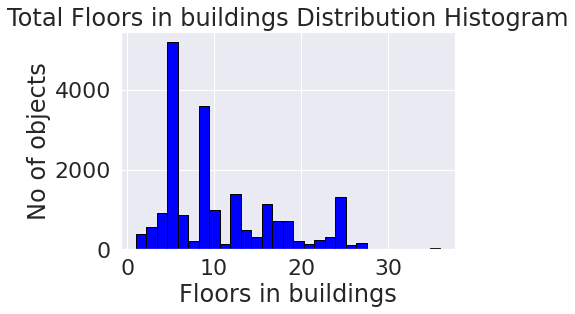
    


```python
(df_normal['floors_total']).value_counts().head(7)
```


    5     5191
    9     3592
    12    1222
    16    1133
    10     981
    4      907
    25     903
    Name: floors_total, dtype: Int64


Как житель новосибирска, я понятия не имел что в питере популярны 12-этажные дома! у нас после  9 этажных идут 16 этажки по популярности. но топ-2 у нас в городе неизменен также! Тоже 5этажки и 9этажки=)

**Посмотрим на распределение расстояния до центра города домов, где находятся квартиры**


```python
(df_normal['cityCenters_nearest']).hist(bins=50, facecolor='blue', edgecolor='black', grid=True)
plt.xlabel('Distance to the City Center')
plt.ylabel('No of objects')
plt.title('Distance to the City Center Distribution Histogram');
```


    

    


Мультимодальный характер распределения в этом случае говорит о том, что существуют некоторые кластеры плотной застройки где в основном и сосредоточены объекты датасета. Скорее всего это популярные города-спутники питера. Типа петергофа или подобного так отражаются на гистограмме. Естественно, самый большой кластер в районе 0-20км принадлежит питеру. 

**Посмотрим на распределение расстояния до аэропорта домов, где находятся квартиры**


```python
(df_normal['airports_nearest']).hist(bins=50, facecolor='blue', edgecolor='black', grid=True)
plt.xlabel('Distance to the Airport')
plt.ylabel('No of objects')
plt.title('Distance to the Airport Distribution Histogram');
```


    
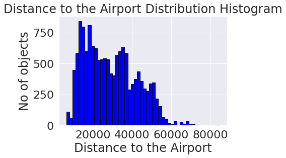
    


Снова прослеживается мультимодальность. Однако в этом случае все немного интереснее. Выраженность кластеров отсутствует так как основной "поставщик" квартир (Спб) находится от аэропорта на очень разных расстояниях (разные куски города на очень разных расстояниях от аэропорта). Эти дома сильно размазаны по нашей гистограмме что портит для нас ясное обнаружение других кластеров

**Посмотрим на распределение расстояния до ближайшего парка домов, где находятся квартиры**


```python
(df_normal['parks_nearest']).hist(bins=50, facecolor='blue', edgecolor='black', grid=True)
plt.xlabel('Distance to the nearest Park')
plt.ylabel('No of objects')
plt.title('Distance to the nearest Park Distribution Histogram');
```


    
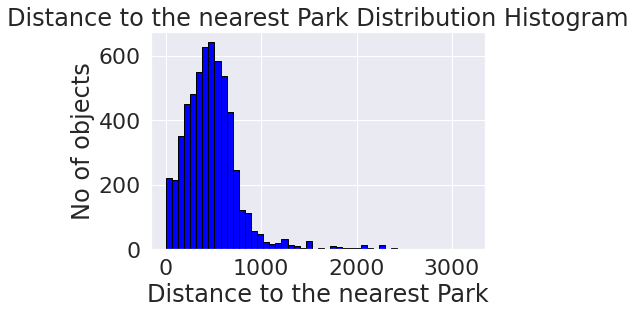
    


Основная масса ближайших парков находится в радиусе 1км. Отчасти это объясняется тем, что питер достаточно зеленый город и туристы его за это любят, а где зелень и музеи там и парки. 

**Посмотрим на распределение дня и месяца публикации объявления**


```python
plt.figure(figsize=(35,10))
plt.ylabel('No of objects')
df_normal.groupby(['first_day_expo_weekday', 'first_day_expo_month'])['total_images'].count().plot(kind="bar", 
                                                                                                   facecolor='blue', 
                                                                                                   edgecolor='black',
                                                                                                   grid=True);
```


    

    


<div class="alert alert-danger">
<b>❌ Комментарий ревьюера v1:</b> 
<br>Тут необходимо изучить день и месяц отдельно. Мы как раз создали столбцы для них в предыдущем шаге
</div>

<div class="alert alert-success">
<b>✔️ Комментарий ревьюера v2:</b>
<br>Правка выполнена 👍
</div>

Некоторая сезонность здесь очевидна. На выходных практически не подаются обьявления. а самыми популярными месяцами является февраль-март июль и октябрь-ноябрь. В мае же наблюдается стабильная просадка. Видимо это как-то связано с выходными. На выходных агентства скорее всего отдыхают и именно этим вызвано то что у нас образуются спады. Не только в субботу-воскресенье но и на маяские праздники когда все хотят зацепить побольше выходных дней и выбраться на природу). Также мало объявлений в январе. Гипотеза скорее всего верная. Объявления которые приходят от агентств недвижимости не попадают к нам в базу в выходные дни включая длинные майские и ноябрьские праздники. Отметим, что в летний период вообще наблюдаются просадки. То есть гипотеза вцелом оправдана - агентства недвижимости ощутимо влияюти на наш датасет!)

<div class="alert alert-success">
<b>✔️ Комментарий ревьюера v1:</b> 
<br>Ты корректно подбираешь основные диапазоны, а также верно читаешь графики, но...
</div>

<div class="alert alert-danger">
<b>❌ Комментарий ревьюера v1:</b> 
<br>...после того как ты внесёшь правки в предыдущем разделе, то выводы могут измениться. Обязательно перепроверь их
</div>

<div class="alert alert-success">
<b>✔️ Комментарий ревьюера v2:</b>
<br>Правка выполнена 👍
</div>

<div class="alert alert-info">
<b>Новые ячейки v1:</b>
<br>
</div>


```python
plt.figure(figsize=(35,10))
plt.ylabel('No of objects')
df_normal.groupby(['first_day_expo_weekday'])['total_images'].count().plot(kind="bar", 
                                                                                                   facecolor='blue', 
                                                                                                   edgecolor='black',
                                                                                                   grid=True);
```


    

    


```python
plt.figure(figsize=(35,10))
plt.ylabel('No of objects')
df_normal.groupby([ 'first_day_expo_month'])['total_images'].count().plot(kind="bar", 
                                                                                                   facecolor='blue', 
                                                                                                   edgecolor='black',
                                                                                                   grid=True);
```


    
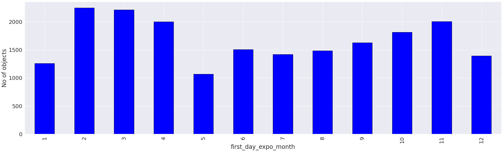
    


Мои выводы из прошлой версии никак не изменились. на этих графиках мы видим те же тенденции которые я описал ранее. Однако здесь отчетливее виден спад на новогодние праздники когда люди начинают активно готовиться к новому году. То есть спады достаточно точно опичываются системным отдыхом людей. Так как отпуска летом у всех размыты на 3 месяца то летний спад от нормы не так бросается в глаза, однако он явно есть. После закрытия бархатного сезона в сентябре люди в агентствах недвижимости возвращаются к работе по немногу и начинают слать объявления что происходит до подготовки страны к очередным гуляниям на новый год. Работает страна только с февраля по апрель и немного в ноябре когда слякоть, остальное время страна предпочитает уделять здоровому отдыху=) 

<div class="alert alert-info">
<b>Конец новых ячеек v1:</b>
<br>
</div>

**Изучим как быстро продаются квартиры**


```python
(df_normal['days_exposition']).hist(bins=50, facecolor='blue', edgecolor='black', grid=True)
plt.xlabel('Days of exposition')
plt.ylabel('No of objects')
plt.title('Days of exposition Distribution Histogram');
```


    
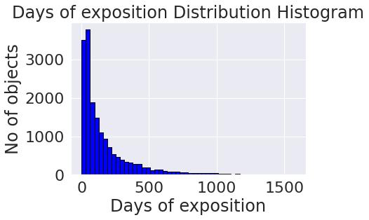
    


```python
mean = (df_normal['days_exposition']).mean()
median = (df_normal['days_exposition']).median()
print(f'Среднее арифмитическое: {mean:.2f}, медиана: {median:.2f}')
```

    Среднее арифмитическое: 169.25, медиана: 90.00


Среднее арифмитическое смещено влево от медианы так как это распределение не является нормальным.
Посмотрим на то как распределена длительность не превышающая 100 дней.


```python
(df_normal['days_exposition']).hist(bins=50, range=(0,100), facecolor='blue', edgecolor='black', grid=True)
plt.xlabel('Days of exposition')
plt.ylabel('No of objects')
plt.title('Days of exposition Distribution Histogram');
```


    
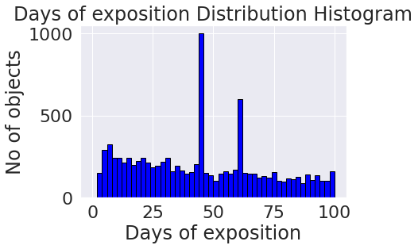
    


Наблюдаем явные пики на 45 и 60 днях. Скорее всего это связано с тем, что объявления скрываются если недвижимость была не продана за определенное время. Так или иначе очевидна явно искуственная составляющая этого процесса.

<div class="alert alert-success">
<b>✔️ Комментарий ревьюера v1:</b> 
<br>Здорово, что ты заметил эти всплески! Это действительно особенность функционирования системы размещения объявлений. Убедиться в этом можно по ссылке ниже

	https://yandex.ru/support/realty/owner/home/add-ads-housing.html
</div>

**Изучим влияние некоторых факторов на цену объекта**

Рассмотрим влияние на цену недвижимости следующих факторов:
* общая площадь
* жилая площадь
* площадь кухни
* количество комнат
* типа этажа
* даты размещения (день недели-месяц-год)

* **Рассмотрим влияние общей площади на цену**


```python
sns.scatterplot(data=df_normal, x="total_area", y="last_price")
plt.xlabel('Total area')
plt.ylabel('Price');
```


    
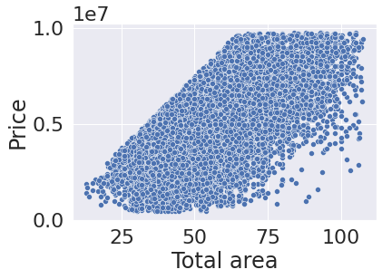
    


Графически мы отчетливо можем наблюдать прямую корреляцию общей площади и цены внутри датасета. Убедимся в наличии такой зависимости расчитав коэффициент корреляции.


```python
corr_coeff = df_normal['total_area'].corr(df_normal['last_price'])
print(f'Коэффициент корреляции по Пирсону: {corr_coeff}')
```

    Коэффициент корреляции по Пирсону: 0.6788398564902485


Положительная корреляция и правда существует, хоть и не очень ярко выраженная. Хотя логика здесь подсказывает что площадь может являться причиной для цены, но не будем забывать о правиле, что корреляция это не показатель причинно-следственной зависимости.

* **Рассмотрим влияние жилой площади на цену**


```python
sns.scatterplot(data=df_normal, x="living_area", y="last_price")
plt.xlabel('Living area')
plt.ylabel('Price');
```


    
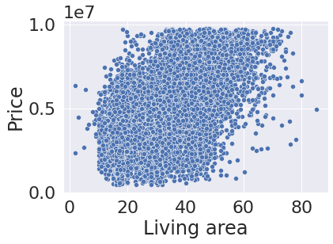
    


Зависимость цены от жилой площади просматривается гораздо менее выраженно, чем в случае с общей площадью. Тем не менее рассчитаем коэффициент Пирсона


```python
corr_coeff = df_normal['living_area'].corr(df_normal['last_price'])
print(f'Коэффициент корреляции по Пирсону: {corr_coeff}')
```

    Коэффициент корреляции по Пирсону: 0.5550751159297326


Полученный результат не позволяет с однозначностью утверждать наличие зависимости между жилой площадью и ценой. Однако, не самый маленький коэффициент кореляции и жизненный опыт подсказывает, что зависимость есть.)

* **Рассмотрим влияние площади кухни на цену**


```python
sns.scatterplot(data=df_normal, x="kitchen_area", y="last_price")
plt.xlabel('Kitchen area')
plt.ylabel('Price');
```


    
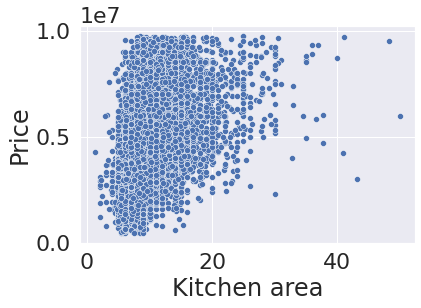
    


Зависимость цены от площади кухни практически не просмоатривается, она есть но очень маленькая. Посчитаем коэффициент корреляции по Пирсону


```python
corr_coeff = df_normal['kitchen_area'].corr(df_normal['last_price'])
print(f'Коэффициент корреляции по Пирсону: {corr_coeff}')
```

    Коэффициент корреляции по Пирсону: 0.4297641622988388


Анализирую графический и аналитические способы выяснения зависимости позволяет сделать вывод о том, что корреляция достаточно малая, но существует между ценой и площадью кухни

* **Рассмотрим влияние количества комнат на цену**


```python
df_normal.boxplot(column='last_price', by='rooms', figsize=(12,9))
plt.xlabel('AMOUNT OF ROOMS IN PROPERTY')
plt.ylabel('PRICE OF PROPERTY')
plt.title('')
plt.suptitle('PRICE vs ROOMS DEPENDENCY');
```


    
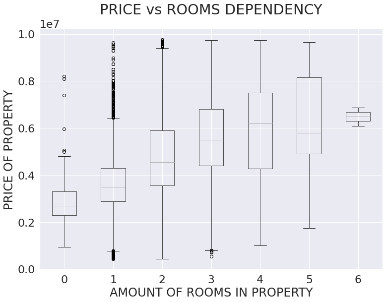
    


Рассматривая график ящиков с усами невооруженным глазом просматривается очевидная прямая зависимость цены недвижимости от числа комнат. Есть некоторое "падение" среднего на графике с 5 комнатными квартирами, но скорее всего это связано с очень маленькой выборкой 5комнатных квартир в датасете. Проверим это.


```python
room_5_count = len(df_normal[df_normal['rooms']==5])
print(f'В датасете {room_5_count} 5-комнатных квартир')
room_6_count = len(df_normal[df_normal['rooms']==6])
print(f'В датасете {room_6_count} 6-комнатных квартир')
```

    В датасете 42 5-комнатных квартир
    В датасете 2 6-комнатных квартир


Как и ожидалось, очень малое количество квартир не позволяет сделать нам сколько нибудь качественную оценку среднего. То есть эта точка на графике ящиков с усами может и не отражает реальное положение дел в Питере (в реальности 5 комнатные не обязательно дешевле 4-комнатных, делать такой вывод основываясь на 42х квартирах было бы легкомысленно). Любопытный читатетль может провести аналитически статистический тест, чтобы убедиться в этом.

* **Рассмотрим влияние типа этажа на цену**


```python
df_normal.boxplot(column='last_price', by='floor_type', figsize=(12,9))
plt.xlabel('FLOOR TYPE OF PROPERTY')
plt.ylabel('PRICE OF PROPERTY')
plt.title('')
plt.suptitle("PRICE vs FLOOR'S TYPE DEPENDENCY");
```


    
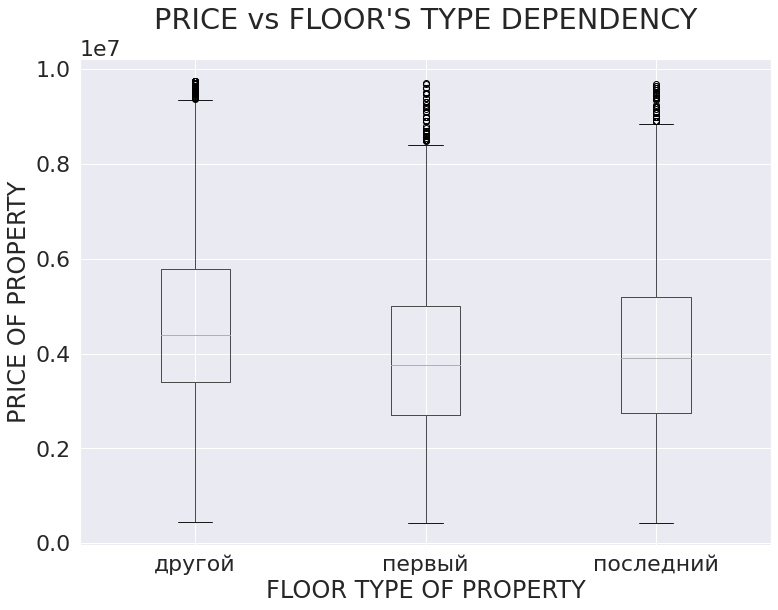
    


Народ в Питере как и ожидалось не очень то любит жилье на первых (проблемы из-за подвала и канализации) и последних этажах (проблемы потенциальные с крышей дома). Это полностью коррелирует со здравым смыслом. Хотя если разбираться в плохом - можно сделать вывод что потенциальные проблемы с чердаком и крышей беспокоят петербуржцев и гостей города несколько меньше проблем из подвалов, где обитают в Питере крысы

* **Рассмотрим влияние даты размещения (день недели-месяц-год) на цену**

Чтобы воспользоваться осмысленно пространством под графики проанализируем отдельно все три параметра даты размещения и их влияние на цену. А именно:
* день недели
* месяц
* год

* *день недели*


```python
df_normal.boxplot(column='last_price', by='first_day_expo_weekday', figsize=(12,9))
plt.xlabel('WEEKDAY OF EXPOSITION')
plt.ylabel('PRICE OF PROPERTY')
plt.title('')
plt.suptitle("PRICE vs WEEKDAY OF EXPOSITION DEPENDENCY");
```


    
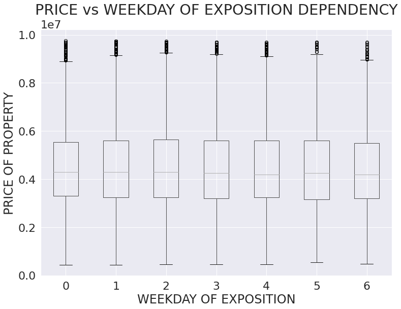
    


Очевидной зависимости не наблюдается. 1 день - слишком маленький шаг по времени для того, чтобы это влияние передалось на тренд цены

* *месяц*


```python
df_normal.boxplot(column='last_price', by='first_day_expo_month', figsize=(12,9))
plt.xlabel('MONTH OF EXPOSITION')
plt.ylabel('PRICE OF PROPERTY')
plt.title('')
plt.suptitle("PRICE vs MONTH OF EXPOSITION DEPENDENCY");
```


    
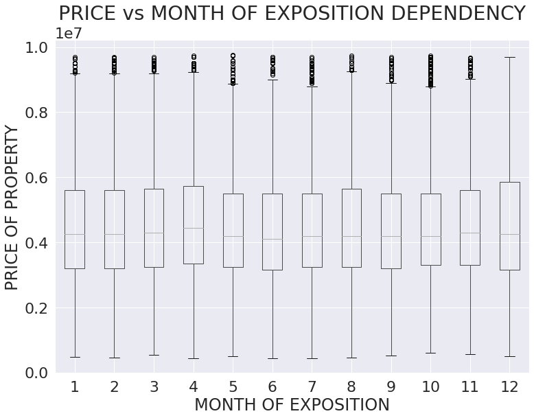
    


Ощутимой зависимости по прежнему нет. Шаг в один месяц тоже мало что может изменить. Однако небольшая сезонность все же имеется. Есть небольшие спады в мае-июне перед маленьким скачком в апреле и некоторый рост к ноябрю. Сложно эти спады как-то проинтерпретировать так как они не носят очевидной разницы в цене и мало логичны, разве что непонятное желание петербуржцев быстрее избавиться от недвижимости к летнеу отпуску и готовность пожить в своем жилье подольше с наступлением холодов, но это домыслы и подгон под результат=).

* *год*


```python
df_normal.boxplot(column='last_price', by='first_day_expo_year', figsize=(12,9))
plt.xlabel('YEAR OF EXPOSITION')
plt.ylabel('PRICE OF PROPERTY')
plt.title('')
plt.suptitle("PRICE vs YEAR OF EXPOSITION DEPENDENCY");
```


    
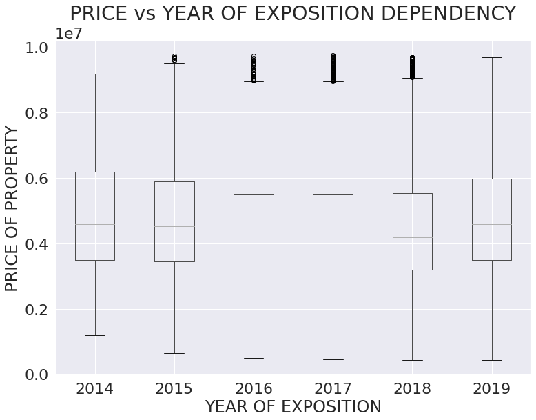
    


Вот чего сложно было представить так это падение цен на недвижимость! Однако в этом есть смысл - в 2014 году была олимпиада и сложная политическая ситуация которая явно отразилась на том, что изначально цена на недвижимостиь была завышена в 2014 и начала постепенный откат до 2016-2017гг. После начался некоторый рост.

<div class="alert alert-success">
<b>✔️ Комментарий ревьюера v1:</b>
<br>Зависимость цены изучена верно! Ещё тут можно использовать для визуализации pairplot из библиотеки seaborn 
    
    https://seaborn.pydata.org/generated/seaborn.pairplot.html
</div>

**Выявим среднюю цену квадратного метра в 10 населенных пунктах с наибольшим количеством объявлений**

Так как среднее арифметическое цены сильно подвержено выбросам то анализировать в качестве меры среднего будем медиану.


```python
top10_local_names = df_normal['locality_name_without_dups'] \
                        .value_counts() \
                        .sort_values(ascending=False) \
                        .head(10)
top10_local_names
```


    Санкт-Петербург    12317
    Мурино               586
    Кудрово              462
    Шушары               432
    Всеволожск           390
    Колпино              335
    Парголово            325
    Пушкин               322
    Гатчина              303
    Выборг               225
    Name: locality_name_without_dups, dtype: int64


```python
sqm_by_city_stats = df_normal[df_normal['locality_name_without_dups'].isin(top10_local_names.index)] \
        .groupby('locality_name_without_dups')['sqm_price'] \
        .median() \
        .sort_values(ascending=False)
highest_median_price_per_sqm = sqm_by_city_stats.index[0]
lowest_median_price_per_sqm = sqm_by_city_stats.index[-1]
print(f'Наименьшая цена квадратного метра в {lowest_median_price_per_sqm}. Наибольшая цена в {highest_median_price_per_sqm}')
```

    Наименьшая цена квадратного метра в Выборг. Наибольшая цена в Санкт-Петербург


<div class="alert alert-danger">
<b>❌ Комментарий ревьюера v1:</b> 
<br>После того как ты выполнишь правку в шаге 2, результат может изменится
</div>

<div class="alert alert-info">
<b>Результат действительно изменился v1</b>
<br>
</div>

<div class="alert alert-success">
<b>✔️ Комментарий ревьюера v2:</b> 
<br>Всё верно! Как вариант, тут можно построить барплот для топ10, так будет более наглядно)
</div>

**Проанализируем среднюю цену квадратного метра жилья в Санкт-Петербурге по мере удаления от центра.**


```python
df_spb = df_normal[df_normal['locality_name_without_dups'] == 'Санкт-Петербург']
price_per_sqm_center_distance_stats = df_spb.groupby('cityCenters_nearest_km')['sqm_price'] \
                                            .agg(median_price_per_sqm='median', count = 'count')
price_per_sqm_center_distance_stats
```


<div>
<style scoped>
    .dataframe tbody tr th:only-of-type {
        vertical-align: middle;
    }

    .dataframe tbody tr th {
        vertical-align: top;
    }

    .dataframe thead th {
        text-align: right;
    }
</style>
<table border="1" class="dataframe">
  <thead>
    <tr style="text-align: right;">
      <th></th>
      <th>median_price_per_sqm</th>
      <th>count</th>
    </tr>
    <tr>
      <th>cityCenters_nearest_km</th>
      <th></th>
      <th></th>
    </tr>
  </thead>
  <tbody>
    <tr>
      <th>0.0</th>
      <td>100000.000000</td>
      <td>5</td>
    </tr>
    <tr>
      <th>1.0</th>
      <td>109807.866780</td>
      <td>66</td>
    </tr>
    <tr>
      <th>2.0</th>
      <td>108404.384896</td>
      <td>125</td>
    </tr>
    <tr>
      <th>3.0</th>
      <td>101982.800983</td>
      <td>196</td>
    </tr>
    <tr>
      <th>4.0</th>
      <td>103286.637931</td>
      <td>312</td>
    </tr>
    <tr>
      <th>5.0</th>
      <td>108064.516129</td>
      <td>387</td>
    </tr>
    <tr>
      <th>6.0</th>
      <td>111269.251984</td>
      <td>308</td>
    </tr>
    <tr>
      <th>7.0</th>
      <td>108333.333333</td>
      <td>235</td>
    </tr>
    <tr>
      <th>8.0</th>
      <td>109276.018100</td>
      <td>379</td>
    </tr>
    <tr>
      <th>9.0</th>
      <td>102201.257862</td>
      <td>477</td>
    </tr>
    <tr>
      <th>10.0</th>
      <td>103333.333333</td>
      <td>597</td>
    </tr>
    <tr>
      <th>11.0</th>
      <td>100903.060817</td>
      <td>1012</td>
    </tr>
    <tr>
      <th>12.0</th>
      <td>101612.903226</td>
      <td>1427</td>
    </tr>
    <tr>
      <th>13.0</th>
      <td>101818.181818</td>
      <td>1259</td>
    </tr>
    <tr>
      <th>14.0</th>
      <td>100995.246583</td>
      <td>1174</td>
    </tr>
    <tr>
      <th>15.0</th>
      <td>99585.062241</td>
      <td>1399</td>
    </tr>
    <tr>
      <th>16.0</th>
      <td>96666.666667</td>
      <td>1186</td>
    </tr>
    <tr>
      <th>17.0</th>
      <td>93548.387097</td>
      <td>815</td>
    </tr>
    <tr>
      <th>18.0</th>
      <td>94078.947368</td>
      <td>245</td>
    </tr>
    <tr>
      <th>19.0</th>
      <td>95592.140202</td>
      <td>147</td>
    </tr>
    <tr>
      <th>20.0</th>
      <td>104000.000000</td>
      <td>43</td>
    </tr>
    <tr>
      <th>21.0</th>
      <td>89285.714286</td>
      <td>111</td>
    </tr>
    <tr>
      <th>22.0</th>
      <td>88849.417801</td>
      <td>192</td>
    </tr>
    <tr>
      <th>23.0</th>
      <td>89965.397924</td>
      <td>81</td>
    </tr>
    <tr>
      <th>24.0</th>
      <td>86353.290416</td>
      <td>26</td>
    </tr>
    <tr>
      <th>25.0</th>
      <td>93612.162162</td>
      <td>26</td>
    </tr>
    <tr>
      <th>26.0</th>
      <td>87368.421053</td>
      <td>43</td>
    </tr>
    <tr>
      <th>27.0</th>
      <td>70312.500000</td>
      <td>1</td>
    </tr>
    <tr>
      <th>28.0</th>
      <td>79873.546512</td>
      <td>6</td>
    </tr>
    <tr>
      <th>29.0</th>
      <td>76084.734212</td>
      <td>6</td>
    </tr>
  </tbody>
</table>
</div>


```python
plt.plot(price_per_sqm_center_distance_stats['median_price_per_sqm'])
plt.xlabel('Distance to the CIty Center')
plt.ylabel('Median price per sqm.');
```


    
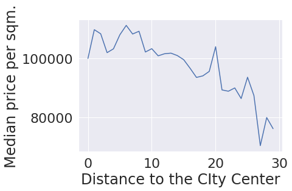
    


В районе 5 км от центра СПб расположен некий район плотной застройки с хорошим и дорогим относительно жильем для покупателей не элитного жилья. Так как мы рассматриваем жилье не элитное то наблюдаются проблемы с нехваткой данных в районе менее 1км от центра. Также в районе 20 км от центра тоже есть район хороших домов какой-то в СПб. 

Посмотрим вцелом. Если убрать из вида некоторые флуктуации цены километра от центра то тренд вполне логичен. Цена падает с удалением от центра города

<div class="alert alert-success">
<b>✔️ Комментарий ревьюера v1:</b>
<br>Отличный анализ 👍
</div>

### Общий вывод

<div class="alert alert-info">
Изменения в выводе добавлены <b>жирным шрифтом :</b>
<br>
</div>

Смогли открыть и посмотреть данные. Обнаружили, проанализировав цену, что в данных присутствует два класса жилья которые принципиально нельзя рассматривать внутри одного датасета потому что законы рынка элитной недвижимости абсолютно иные. Займемся разделением датасета в следующем разделе.

Разбили исходный датасет на два. Обычной и элитной недвижимости. В качестве разделителя был выбран показатель в цене 150к за кв.м. взятый с одного из аналитических отчетов в интернете.

Очистили оба наших датасета от данных если у исследуемого признака пропусков в обоих классах жилья менее 5% удалив такие данные.

Пропуски в поле `апартаменты` заменили на False; в `балкон` заменили на 0

**в `высоте потолков` для обычного жилья ввиду малого стандартного отклонения (менее 1) этого признака пропуски были заменены на медианное значение. В случае с элитным жильем где стандартное отклонение было сравнимо с показателями среднегго такую тактику было применять бесполезно и более того - губительно для данных - поэтому в элитном жилье такие пропуски не заполнялись**. 

Заменить же пропуски в `общей площади` жилья, `площади кухни` - ничем разумным не представлялось возможным - использование для этих целей медианы и подобных значений мало поможет так как мы занимаемся анализом рынка недвижимости и очень вряд ли площадь жилья конкретной квартиры можно заменить средней площадью жилья по городу. Заполнение же пропусков в количестве дней нахождения объявления в ротации - вообще губительно для данных - жилье может быть не продано на момент создания датасета.

`расстояния до ближайшего парка` и `пруда` является пропуском, если в радиусе 3км нет ни одного парка или пруда соответственно. Такие пропуски имеют также смысл и трогать их не стоит. 

Были обнаружены пропуски в столбце `количества парков` и `водоемов` в радиусе 3км. Эти пропуски тоже бесполезно чем-то заменять так как судя по их количеству (оно совпадает) с количеством пропусков в дистанции маршрута до аэропорта и центра

Причина пропусков в `количестве водоемов/парков в радиусе 3км` - пропуски в расстояниях до аэропорта и центра города. Именно пропуски в расстояниях до аэропорта и центра города, скорее всего и являются причиной всех пропусков в гео-данных. Они могли взяться из-за невозможности вычислить координаты объекта. Возможно создатель объявление не указал точный адрес объекта и мы не смогли вычислить вычисляемые параметры по геолокации помещения такие как водная и парковая инфраструктура

Подумаем, что могло привести к потере данных для каждого столбца:
  
  * `высота потолков` - удивительно, что пропущенно всего менее 40% для обоих классов недвижимости. Высота потолков не является той информацией, которой хорошо владеют собственники и часто публикуют в объявлениях. Были просмотрены разные сайты по продаже жилья и почти нигде не был обнаружен такой параметр как высота потолков.
    
  * `жилая площадь`, `площадь кухни` - пропуски здесь могли появиться из-за того, что это уже весьма детализирующие объект признаки и не все продавцы хотят вносить такие данные в объявление.
    
  *  `балконы` - тут все может объясняться просто. Балкон это прерогатива и бонус. Раз его нет то и не указать можно.
    
  *  `расстояние до аэропорта`, `расстояние до центра` - это те параметры которые вычисляет система, но она не может вычислить эти параметры, если не знает точные координаты объекта. Скорее всего, пользователь предпочел не указывать в объявлении точный адрес своего объекта.
    
  * `количество парков в радиусе 3км`, `количество водоемов в радиусе 3км` - не зная геолокацию объектов мы не сможем вычислить и количество объектов водной/парковой инфраструктуры в окрестности объекта недвижимости
    
  * `расстояние до ближайшего парка`, `расстояние до ближайшего водоема` - помимо тех ситуаций когда мы не знаем геолокации объекта недвижимости сюда добавляются пропуски в тех ситуациях когда в радиусе 3 км отсутствует парк/водоем. Приблизительно совпадающее число пропусков в расстоянии до ближайших парков и водоемов связано скорее всего с тем, что Петербург стоит на Неве и воды там много и парков много потому что город туристический. Значит, если есть парк то есть и водоем в этом парке. Нет парка - нет и водоема. Логично же делать парки там где есть водоемы=)
  
  * `длительность размещения объявления` - пропуски трогать тут не следует - по ним мы узнаем объявления, которые находились в ротации на сайте на момент создания датасета. 
  
Были удалены неявные дубликаты в названиях локаций.

Был произведен анализ аномалий данных и пришли к следующим выводам:

* `total_images`, `balcony`, `floor` - выглядят вполне реалистично, не удаляем выбросы
* `total_area`, `rooms`, `living_area`, `kitchen_area` - так как мы сосредоточены на анализе рынка обычной недвижимости в этом датафрейме сейчас то из этого датафрейма уберем жилье явно иного класса (элитное жилье) руководствуясь отсечкой по усам.
* `last_price` - нашлась квартира стоимостью менее 13.000 рублей. такого точно не может быть, удалим и ее. квартиры выше чем правый ус удалим также руководствуюясь логикой из предыдущего пункта.
* `ceiling_height` - удалим объекты со значениями высоты потолков менее 2х метров (3 шт) и в интервале [6;20], а значения выше 20 поделим на 10.
* `floors_total` - домов более 50 этажей в Питере не бывает. скорее всего опечатка, таких объектов всего 2, удалим эти объекты, так как гадать реальную этажность для столь незначительного количества данных не имеет смысла.
* `airports_nearest`, `cityCenters_nearest`, `parks_nearest`, `ponds_nearest`, `ponds_around3000`, `parks_around3000` - вычислены автоматически, не будем удалять выбросы такого типа так как они отражают реальную суть наблюдаемого явления и будут полезны при анализе.
* `days_exposition` - не будем трогать. выбросы там критически нужны для будущего анализа, пусть даже подготовленного не нами.

Отметим, что мы не удаляем объекты с подозрительно на первый взгляд маленьким количеством комнат (0). Предварительно мы проверили, что все такие квартиры или являются студиями или являются квартирами со свободной планировкой.

Добавили в анализируемый датасет следующие столбцы:

* цену одного квадратного метра (`sqm_price`)
* день недели публикации объявления (`first_day_expo_weekday`)
* месяц публикации объявления (`first_day_expo_month`)
* год публикации объявления (`first_day_expo_year`)
* тип этажа квартиры (`floor_type`)
* расстояние до центра в километрах с точностью до 2х знаков после запятой (`cityCenters_nearest_km`)

Далее мы приступили к исследовательскому анализу данных (EDA)

* Отчетливо виден мультимодальный характер распределения `общей площади` жилья. Эта мультимодальность объяснилась вхождением квартир с разным количеством комнат. У каждого такого типа квартиры есть свое характерное значение площади. Для наиболее популярных квартир оно следующее. ~(27кв.м., 43кв.м., 57кв.м.) - характерные площади для 1-2-3-комнатных квартир соответственно.

* Мультимодальность распределения `жилой площали` объясняется также различным количеством комнат и характерных площпдей жилой площади для таких квартир.

* Наблюдается одномодальное распределение с вытянутым вправо краем для площади кухни (что неудивительно так как в нашу выборку могли попасть квартиры нестандартной планировки, элитные). 

* Что касается `цены недвижимости` то можно наблюдать, что за исключением некоторых пиков мы получили распределение близкое к нормальному с одной модой. Этому способствовало как то, что мы разделяли жилье на обычное и элитное по цене за квадратный метр так и то, что мы отбрасывали выбросы на этапе чистки данных.

* Рассмотрев распределение `количества комнат` мы получили вполне ожидаемый результат (квартрир без комнат (студий, свободных планировок и тд)) - не то чтоб очень много. А вот чего действительно много так это однушек, двушек и трешек. 4х комнатные квартиры хоть и присутствуют в достаточном объеме, но не делают уже большой погоды в этом датасете, равно как и более многокомнатные квартиры. Самые популярные во всех практически городах это однушки и двушки, что ожидаемо)

* Прианализе `высоты потолков` объектов несложно заметить что самый популярная высота потолков в питере для обычного жилья составляет 2,5 метра. Это вполне ожидаемо, так как минимальная высота потолков по СНиПам составляет 2,4 метра. **при замене пропусков в `высоте потолков` было получено иное популярное значение высоты - 2.6м. - оно искуственное ибо заполнено медианой, хоть и отличается от оригинала не сильно**

* Анализируя `этаж квартиры` обнаружили, что после 5 и 9 этажа мы видим спад так как в стране у нас очень много 5 и 9 этажных домов. Просадка количества объектов на 1м этаже объясняется скорее всего тем, что в России 1ые этажи зданий часто используются под коммерческую недвижимость, а не под жилье.

* При анализе `типа этажа квартиры` (первый, последний другой) выяснилось, что первых и последних этажей примерно равное количество, но первых чуточку меньше. Разница, возможно, опять вызвана тем, что на первых этажах зачастую находится коммерческая недвижимость

* При анализе `этажности` объектов получили ожидаемый результат, что самым популярным домом является пятиэтажка. за ней следует 9 и 12 этажные постройки.

* При анализе `расстояния до центра` обнаружено, что мультимодальный характер распределения в этом случае говорит о том, что существуют некоторые кластеры плотной застройки где в основном и сосредоточены объекты датасета. Скорее всего это популярные города-спутники питера. Типа петергофа или подобного так отражаются на гистограмме. Естественно, самый большой кластер в районе 0-20км принадлежит питеру.

* При анализе `расстояния до аэропорта` снова прослеживается мультимодальность. Однако в этом случае все немного интереснее. Выраженность кластеров отсутствует так как Spb как основной "поставщик" квартир находится от аэропорта на очень разных расстояниях (разные куски города на очень разных расстояниях от аэропорта). Эти дома сильно размазаны по нашей гистограмме что портит для нас ясное обнаружение других кластеров

* При анализе `расстояния до ближайшего парка` выяснилось, чтио основная масса ближайших парков находится в радиусе 1км. Отчасти это объясняется тем, что питер достаточно зеленый город и туристы его за это любят, а где зелень и музеи там и парки.

* При анализе `дня и месяца публикации` некоторая сезонность здесь очевидна. На выходных практически не подаются обьявления. а самыми популярными месяцами является февраль-март и октябрь-ноябрь. В мае же наблюдается стабильная просадка. Видимо это как-то связано с выходными. На выходных агентства скорее всего отдыхают и именно этим вызвано то что у нас образуются спады. Не только в субботу-воскресенье но и на маяские праздники когда все хотят зацепить побольше выходных дней и выбраться на природу). Также мало объявлений в **декабре-** январе. Гипотеза скорее всего верная. Объявления которые приходят от агентств недвижимости не попадают к нам в базу в выходные дни включая длинные майские праздники и период отпусков и новогодних каникул. Отметим, что в летний период вообще наблюдаются просадки. То есть гипотеза вцелом оправдана - агентства недвижимости ощутимо влияюти на наш датасет!)

* При анализе `времени ротации` объявлений о продаже мы наблюдаем явные пики на 45 и 60 днях. Скорее всего это связано с тем, что объявления скрываются если недвижимость была не продана за определенное время. Так или иначе очевидна явно искуственная составляющая этого процесса.

* Графически мы отчетливо можем наблюдать прямую корреляцию `общей площади` и `цены` внутри датасета. Убедились в этом и при расчете корреляции по Пирсону.

* Зависимость `цены` от `жилой площади` просматривается гораздо менее выраженно, чем в случае с `общей площадью`. Тем не менее при расчете корреляции по Пирсону (~0.56) было принято решение, что зависимостиь все же существует

* На графике зависимость `цены` от `площади кухни` практически не просмоатривается, она есть но очень маленькая. При расчете коэффициента корреляции по Пирсону мы убедились в достаточно слабой, хоть и имеющейся связи между этими параметрами (~0.43)

* Рассматривая график ящиков с усами для анализа зависимости `цены недвижимости` от `количества комнат` в ней невооруженным глазом просматривается очевидная прямая зависимость между этими величинами. Есть некоторое "падение" среднего на графике с 6 комнатными квартирами, но скорее всего это связано с очень маленькой выборкой 6комнатных квартир в датасете.

* При анализе типа этажа (первый, последний, иной) на цену выяснилось, что народ в Питере как и ожидалось не очень то любит жилье на первых (проблемы из-за подвала и канализации) и последних этажах (проблемы потенциальные с крышей дома). Это полностью коррелирует со здравым смыслом. Хотя если разбираться в плохом - можно сделать вывод что потенциальные проблемы с чердаком и крышей беспокоят петербуржцев и гостей города несколько меньше проблем из подвалов, где обитают в Питере крысы

* При анализе влияния на `цену` `дня выставления объявления` очевидной зависимости между параметрами не наблюдается. 1 день - слишком маленький шаг по времени для того, чтобы это влияние передалось на тренд цены

* При анализе влияния на `цену` `месяца выставления объявления` ощутимой зависимости не наблюдается. Шаг в один месяц тоже мало что может изменить. Однако небольшая сезонность все же имеется. Есть небольшие спады в марте, мае и сентябре. Сложно эти спады как-то проинтерпретировать так как они не носят очевидной разницы в цене и мало логичны.

* При анализе влияния на `цену` `года выставления объявления` сложно было представить падение цен на недвижимость со временем! Однако в этом есть смысл - в 2014 году была олимпиада и сложная политическая ситуация которая явно отразилась на том, что изначально цена на недвижимостиь была завышена в 2014 и начала постепенный откат до 2016-2017гг. После начался некоторый рост.

* Было выяснено, что наименьшая `цена квадратного метра` в населенном пункте Всеволожск. Наибольшая цена - в Санкт-Петербург, что достаточно логично для рынка не элитной недвижимости.

* При анализе средней `цены квадратного метра` по мере удаления от центра обнаружено, что в районе 5 км от центра СПб расположен некий район плотной застройки с хорошим и дорогим относительно жильем для покупателей не элитного жилья. Так как мы рассматриваем жилье не элитное то наблюдаются проблемы с нехваткой данных в районе менее 1км от центра. Также в районе 20 км от центра тоже есть район хороших домов какой-то в СПб. Посмотрев же вцелом на тренд если убрать из вида некоторые флуктуации цены километра от центра то ситуация вполне логична. Цена падает с удалением от центра города

Отметим, что мы использовали медиану в своих расчетах в качестве меры среднего так как она более устойчива к выбросам.

Резюмируя проделанную работу можно сказать что проведено начальное исследование рынка жилья Санкт-Петербурга и окрестностей. В дальнейшем можно заняться продолжением анализа рынка элитной недвижимости региона, начальный датасет для этого подготовлен в ходе проекта. 

<div class="alert alert-danger">
<b>❌ Комментарий ревьюера v1:</b> 
<br>После всех внесённых правок, обязательно перепроверь общий вывод и промежуточные выводы и поправь их по необходимости
</div>

<div class="alert alert-danger">
<b>❌ Итоговый комментарий ревьюера v1:</b> 
<br>Ты хорошо потрудился, большая часть работы сделана, но остаётся внести следующие правки:
<br>- отбросить аномальные значения 
<br>- построить график для дня недели и месяца публикации объявления
<br>- поправить выводы там, где это необходимо
</div>

<div class="alert alert-success">
<b>✔️ Итоговый комментарий ревьюера v2:</b>
<br>Все правки выполнены. Молодец!
<br>Проделана огромная работа! У тебя подробные, понятные и логичные выводы, которые ты подкрепляешь фактами. Были использованы разные графики и способы, чтобы как можно более тщательно изучить данные и у тебя это получилось! 
<br>Я рад был поработать над проверкой твоей работы) В качестве дополнительного материала для изучения могу порекомендовать следующий ресурс:

	https://www.python-graph-gallery.com/
<br>В нем содержится большая библиотека графиков с готовым кодом, который можно использовать при работе.
<br>Поздравляю со сдачей проекта и желаю удачи в дальнейшем обучении! 😉    
</div>

**Чек-лист готовности проекта**

Поставьте 'x' в выполненных пунктах. Далее нажмите Shift+Enter.

- [x]  открыт файл
- [x]  файлы изучены (выведены первые строки, метод `info()`, гистограммы и т.д.)
- [x]  определены пропущенные значения
- [x]  заполнены пропущенные значения там, где это возможно
- [x]  есть пояснение, какие пропущенные значения обнаружены
- [x]  изменены типы данных
- [x]  есть пояснение, в каких столбцах изменены типы и почему
- [x]  устранены неявные дубликаты в названиях населённых пунктов
- [x]  устранены редкие и выбивающиеся значения (аномалии) во всех столбцах
- [x]  посчитано и добавлено в таблицу: цена одного квадратного метра
- [x]  посчитано и добавлено в таблицу: день публикации объявления (0 - понедельник, 1 - вторник и т.д.)
- [x]  посчитано и добавлено в таблицу: месяц публикации объявления
- [x]  посчитано и добавлено в таблицу: год публикации объявления
- [x]  посчитано и добавлено в таблицу: тип этажа квартиры (значения — «первый», «последний», «другой»)
- [x]  посчитано и добавлено в таблицу: расстояние в км до центра города
- [x]  изучены и описаны следующие параметры:
        - общая площадь;
        - жилая площадь;
        - площадь кухни;
        - цена объекта;
        - количество комнат;
        - высота потолков;
        - этаж квартиры;
        - тип этажа квартиры («первый», «последний», «другой»);
        - общее количество этажей в доме;
        - расстояние до центра города в метрах;
        - расстояние до ближайшего аэропорта;
        - расстояние до ближайшего парка;
        - день и месяц публикации объявления
- [x]  построены гистограммы для каждого параметра
- [x]  выполнено задание: "Изучите, как быстро продавались квартиры (столбец days_exposition). Этот параметр показывает, сколько дней «висело» каждое объявление.
    - Постройте гистограмму.
    - Посчитайте среднее и медиану.
    - В ячейке типа markdown опишите, сколько обычно занимает продажа. Какие продажи можно считать быстрыми, а какие — необычно долгими?"
- [x]  выполнено задание: "Какие факторы больше всего влияют на общую (полную) стоимость объекта? Постройте графики, которые покажут зависимость цены от указанных ниже параметров. Для подготовки данных перед визуализацией вы можете использовать сводные таблицы."
        - общей площади;
        - жилой площади;
        - площади кухни;
        - количество комнат;
        - типа этажа, на котором расположена квартира (первый, последний, другой);
        - даты размещения (день недели, месяц, год);
- [x]  выполнено задание: "Посчитайте среднюю цену одного квадратного метра в 10 населённых пунктах с наибольшим числом объявлений. Выделите населённые пункты с самой высокой и низкой стоимостью квадратного метра. Эти данные можно найти по имени в столбце `locality_name`."
- [x]  выполнено задание: "Ранее вы посчитали расстояние до центра в километрах. Теперь выделите квартиры в Санкт-Петербурге с помощью столбца `locality_name` и вычислите среднюю цену каждого километра. Опишите, как стоимость объектов зависит от расстояния до центра города."
- [x]  в каждом этапе есть промежуточные выводы
- [x]  есть общий вывод
